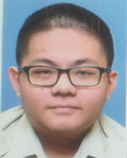
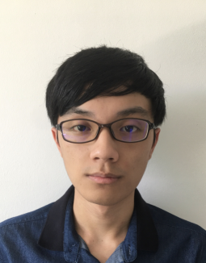
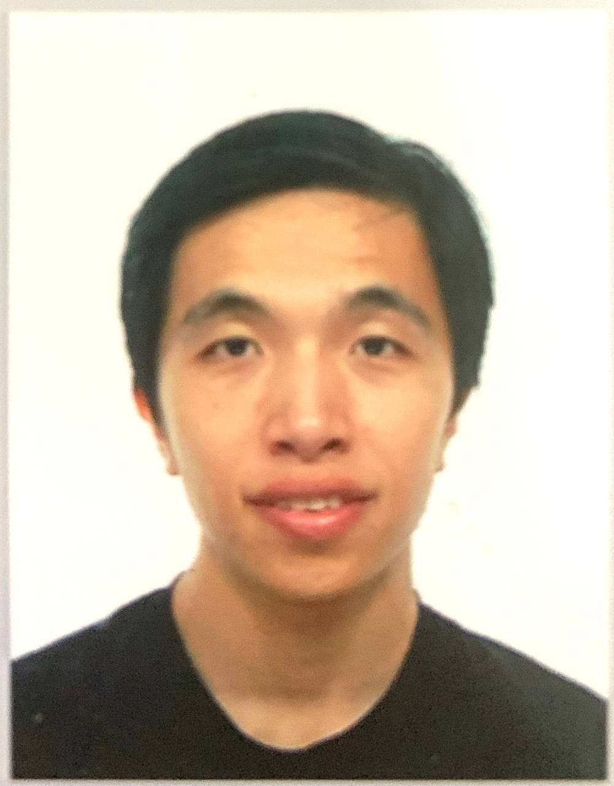

We are a team based in the [School of Computing, National University of Singapore](http://www.comp.nus.edu.sg).

You can reach us at the email `jiahaolow2020@gmail.com`

## Project team

### Low Jia Hao

[[github](https://github.com/LowJiaHao99)]
[[portfolio](team/lowjiahao99.md)]

* Role: Team lead
* Responsibilities: Model and API testing

### Lim Jan Jay

[[github](https://github.com/jaysmyname)]
[[portfolio](team/jaysmyname.md)]

* Role: Developer
* Responsibilities: UI and GUI testing

### Huang Qing

[[github](http://github.com/hqhqhq1)]
[[portfolio](team/hqhqhq1.md)]

* Role: Developer
* Responsibilities: Storage, code quality, deliverables, deadlines, Scheduling and tracking

### Khor Vanessa

[[github](http://github.com/vanessaxuuan)]
[[portfolio](team/vanessaxuuan.md)]

* Role: Developer
* Responsibilities: Integration, logic and documentation

