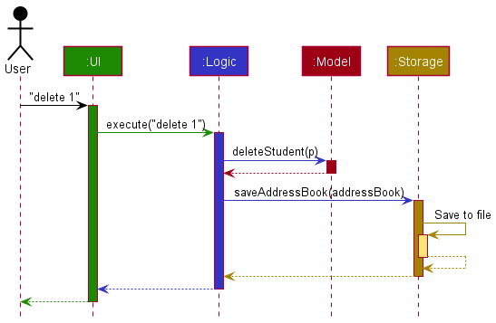
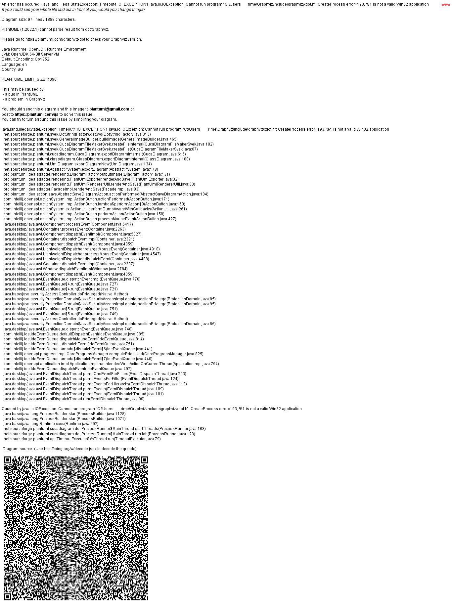
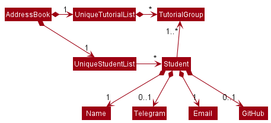
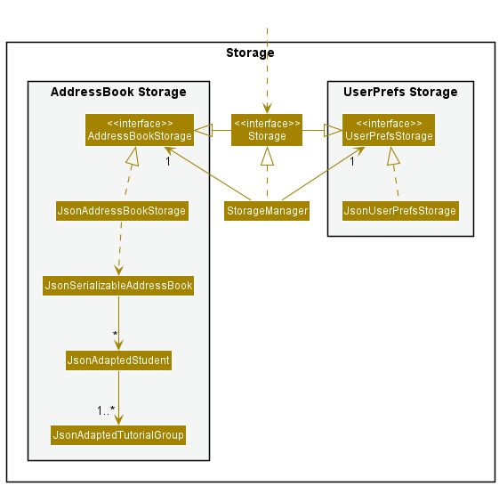
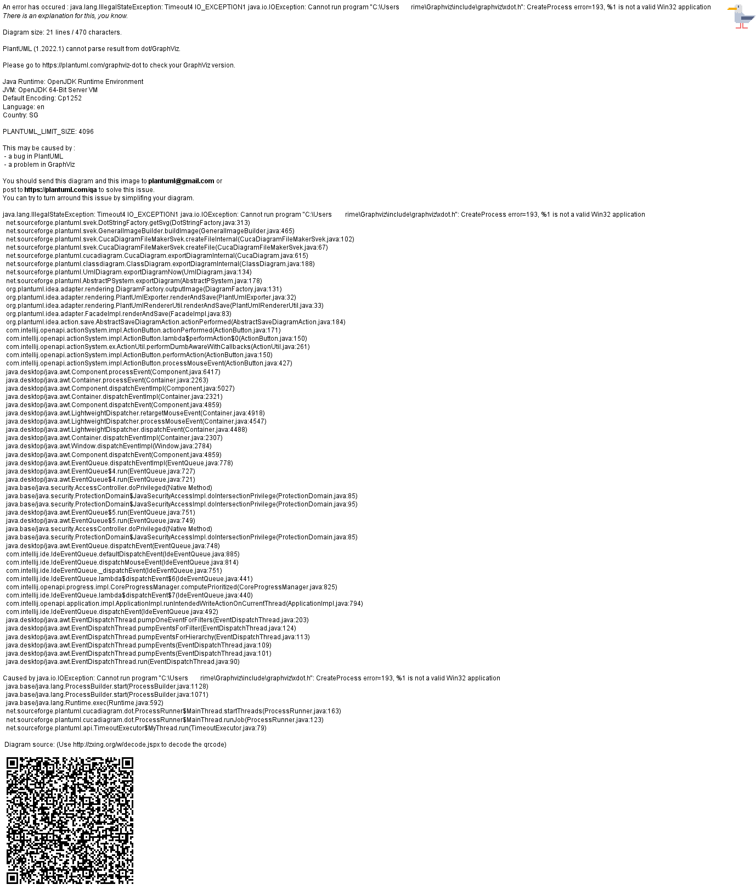

* Table of Contents
{:toc}

--------------------------------------------------------------------------------------------------------------------

## **Acknowledgements**

* {list here sources of all reused/adapted ideas, code, documentation, and third-party libraries -- include links to the original source as well}

--------------------------------------------------------------------------------------------------------------------

## **Setting up, getting started**

Refer to the guide [_Setting up and getting started_](SettingUp.md).

--------------------------------------------------------------------------------------------------------------------

## **Design**

<div markdown="span" class="alert alert-primary">

:bulb: **Tip:** The `.puml` files used to create diagrams in this document can be found in the [diagrams](https://github.com/se-edu/addressbook-level3/tree/master/docs/diagrams/) folder. Refer to the [_PlantUML Tutorial_ at se-edu/guides](https://se-education.org/guides/tutorials/plantUml.html) to learn how to create and edit diagrams.
</div>

### Architecture


The ***Architecture Diagram*** given above explains the high-level design of the App.

Given below is a quick overview of main components and how they interact with each other.

**Main components of the architecture**

**`Main`** has two classes called [`Main`](https://github.com/se-edu/addressbook-level3/tree/master/src/main/java/seedu/address/Main.java) and [`MainApp`](https://github.com/se-edu/addressbook-level3/tree/master/src/main/java/seedu/address/MainApp.java). It is responsible for,
* At app launch: Initializes the components in the correct sequence, and connects them up with each other.
* At shut down: Shuts down the components and invokes cleanup methods where necessary.

[**`Commons`**](#common-classes) represents a collection of classes used by multiple other components.

The rest of the App consists of four components.

* [**`UI`**](#ui-component): The UI of the App.
* [**`Logic`**](#logic-component): The command executor.
* [**`Model`**](#model-component): Holds the data of the App in memory.
* [**`Storage`**](#storage-component): Reads data from, and writes data to, the hard disk.


**How the architecture components interact with each other**

The *Sequence Diagram* below shows how the components interact with each other for the scenario where the user issues the command `delete 1`.



Each of the four main components (also shown in the diagram above),

* defines its *API* in an `interface` with the same name as the Component.
* implements its functionality using a concrete `{Component Name}Manager` class (which follows the corresponding API `interface` mentioned in the previous point.

For example, the `Logic` component defines its API in the `Logic.java` interface and implements its functionality using the `LogicManager.java` class which follows the `Logic` interface. Other components interact with a given component through its interface rather than the concrete class (reason: to prevent outside component's being coupled to the implementation of a component), as illustrated in the (partial) class diagram below.


The sections below give more details of each component.

### UI component

The **API** of this component is specified in [`Ui.java`](https://github.com/se-edu/addressbook-level3/tree/master/src/main/java/seedu/address/ui/Ui.java)


The UI consists of a `MainWindow` that is made up of parts e.g.`CommandBox`, `ResultDisplay`, `PersonListPanel`, `StatusBarFooter` etc. All these, including the `MainWindow`, inherit from the abstract `UiPart` class which captures the commonalities between classes that represent parts of the visible GUI.

The `UI` component uses the JavaFx UI framework. The layout of these UI parts are defined in matching `.fxml` files that are in the `src/main/resources/view` folder. For example, the layout of the [`MainWindow`](https://github.com/se-edu/addressbook-level3/tree/master/src/main/java/seedu/address/ui/MainWindow.java) is specified in [`MainWindow.fxml`](https://github.com/se-edu/addressbook-level3/tree/master/src/main/resources/view/MainWindow.fxml)

The `UI` component,

* executes user commands using the `Logic` component.
* listens for changes to `Model` data so that the UI can be updated with the modified data.
* keeps a reference to the `Logic` component, because the `UI` relies on the `Logic` to execute commands.
* depends on some classes in the `Model` component, as it displays `Person` object residing in the `Model`.

### Logic component

**API** : [`Logic.java`](https://github.com/se-edu/addressbook-level3/tree/master/src/main/java/seedu/address/logic/Logic.java)

Here's a (partial) class diagram of the `Logic` component:


How the `Logic` component works:
1. When `Logic` is called upon to execute a command, it uses the `AddressBookParser` class to parse the user command.
1. This results in a `Command` object (more precisely, an object of one of its subclasses e.g., `AddCommand`) which is executed by the `LogicManager`.
1. The command can communicate with the `Model` when it is executed (e.g. to add a person).
1. The result of the command execution is encapsulated as a `CommandResult` object which is returned back from `Logic`.

The Sequence Diagram below illustrates the interactions within the `Logic` component for the `execute("delete 1")` API call.


<div markdown="span" class="alert alert-info">:information_source: **Note:** The lifeline for `DeleteCommandParser` should end at the destroy marker (X) but due to a limitation of PlantUML, the lifeline reaches the end of diagram.
</div>

Here are the other classes in `Logic` (omitted from the class diagram above) that are used for parsing a user command:


How the parsing works:
* When called upon to parse a user command, the `AddressBookParser` class creates an `XYZCommandParser` (`XYZ` is a placeholder for the specific command name e.g., `AddCommandParser`) which uses the other classes shown above to parse the user command and create a `XYZCommand` object (e.g., `AddCommand`) which the `AddressBookParser` returns back as a `Command` object.
* All `XYZCommandParser` classes (e.g., `AddCommandParser`, `DeleteCommandParser`, ...) inherit from the `Parser` interface so that they can be treated similarly where possible e.g, during testing.

### Model component
**API** : [`Model.java`](https://github.com/se-edu/addressbook-level3/tree/master/src/main/java/seedu/address/model/Model.java)




The `Model` component,

* stores the address book data i.e., all `Person` objects (which are contained in a `UniquePersonList` object).
* stores the currently 'selected' `Person` objects (e.g., results of a search query) as a separate _filtered_ list which is exposed to outsiders as an unmodifiable `ObservableList<Person>` that can be 'observed' e.g. the UI can be bound to this list so that the UI automatically updates when the data in the list change.
* stores a `UserPref` object that represents the user’s preferences. This is exposed to the outside as a `ReadOnlyUserPref` objects.
* does not depend on any of the other three components (as the `Model` represents data entities of the domain, they should make sense on their own without depending on other components)

<div markdown="span" class="alert alert-info">:information_source: **Note:** An alternative (arguably, a more OOP) model is given below. It has a `Tag` list in the `AddressBook`, which `Person` references. This allows `AddressBook` to only require one `Tag` object per unique tag, instead of each `Person` needing their own `Tag` objects.<br>



</div>


### Storage component

**API** : [`Storage.java`](https://github.com/se-edu/addressbook-level3/tree/master/src/main/java/seedu/address/storage/Storage.java)



The `Storage` component,
* can save both address book data and user preference data in json format, and read them back into corresponding objects.
* inherits from both `AddressBookStorage` and `UserPrefStorage`, which means it can be treated as either one (if only the functionality of only one is needed).
* depends on some classes in the `Model` component (because the `Storage` component's job is to save/retrieve objects that belong to the `Model`)

### Common classes

Classes used by multiple components are in the `seedu.addressbook.commons` package.

--------------------------------------------------------------------------------------------------------------------

## **Implementation**

This section describes some noteworthy details on how certain features are implemented.

### Telegram and GitHub attribute implementations


The diagram above shows that a `Student` may or may not have a `Telegram` and a `Github`. Students with empty `GitHub` and `Telegram` are stored using `GitHub` and `Telegram` instantiated with empty strings as shown below



#### How does it work?

Below is a sequence diagram for `addStudentCommand`. The command was implemented such that all inputs have to be parsed by the respective methods of `ParserUtil`.


>**Note:** parseGitHub and parseTelegram methods now accommodate null as inputs<br/>
> Here is a snippet for parseGitHub. parseTelegram has a similar format as well
> ```
> public static GitHub parseGitHub(String gitHub) throws ParseException {
>     if (gitHub == null) {
>         return new GitHub(null);
>     }
>     String trimmedGitHub = gitHub.trim();
>     if (!GitHub.isValidGitHub(trimmedGitHub)) {
>         throw new ParseException(GitHub.MESSAGE_CONSTRAINTS);
>     }
>     return new GitHub(trimmedGitHub);
> }
> ```

GitHub and Telegram objects instantiated with null inputs have a value of ""
Here is a snippet for the constructor of Telegram. GitHub also have a similar format
```aidl
public Telegram(String telegram) {
    if (telegram == null) { //if telegram is empty it will exist as an empty string
        value = "";
    } else {
        checkArgument(isValidTelegram(telegram), MESSAGE_CONSTRAINTS);
        value = telegram;
    }
}
```

This means that an empty `GitHub` object will have a "" value and a `GitHub` object with a value of "" means that it is an empty `GitHub` object. The same logic applies to `Telegram` objects as well

#### Why does it work?
As shown in the previous sequence diagram, `ParserUtil` parses all the inputs for the add command. Thus, an empty string (i.e. "") will be parsed though the method isValidXX, where XX is an attribute i.e. isValidName. All empty string will throw an error in any of parse methods in `ParserUtil`
Thus an empty string will never be able to be accepted through the user input. Therefore, an empty string was used as a means to identify and instantiate attributes that can be empty (e.g. GitHub and Telegram).

#### Design Considerations:

##### How empty GitHub and Telegram should be stored:

* Alternative 1 : stored as null
  * Pros: Easy to implement
  * Cons: NullPointerException can occur if `.toString()`of null is called

* Alternative 2: stored as a reserved valid string e.g. "null"
  * Pros: Avoid NullPointerExceptions
  * Cons: Possibility of a student whose telegram and github be the string "null".

* Alternative 3 (Current Choice): stored as an invalid string i.e. ""
  * Pros: Avoid NullPointerExceptions
  * Cons: We must ensure that the conversion from Object to Json and vice-versa must be correct.

### \[Proposed\] Undo/redo feature

#### Proposed Implementation

The proposed undo/redo mechanism is facilitated by `VersionedAddressBook`. It extends `AddressBook` with an undo/redo history, stored internally as an `addressBookStateList` and `currentStatePointer`. Additionally, it implements the following operations:

* `VersionedAddressBook#commit()` — Saves the current address book state in its history.
* `VersionedAddressBook#undo()` — Restores the previous address book state from its history.
* `VersionedAddressBook#redo()` — Restores a previously undone address book state from its history.

These operations are exposed in the `Model` interface as `Model#commitAddressBook()`, `Model#undoAddressBook()` and `Model#redoAddressBook()` respectively.

Given below is an example usage scenario and how the undo/redo mechanism behaves at each step.

Step 1. The user launches the application for the first time. The `VersionedAddressBook` will be initialized with the initial address book state, and the `currentStatePointer` pointing to that single address book state.


Step 2. The user executes `delete 5` command to delete the 5th person in the address book. The `delete` command calls `Model#commitAddressBook()`, causing the modified state of the address book after the `delete 5` command executes to be saved in the `addressBookStateList`, and the `currentStatePointer` is shifted to the newly inserted address book state.


Step 3. The user executes `add n/David …​` to add a new person. The `add` command also calls `Model#commitAddressBook()`, causing another modified address book state to be saved into the `addressBookStateList`.


<div markdown="span" class="alert alert-info">:information_source: **Note:** If a command fails its execution, it will not call `Model#commitAddressBook()`, so the address book state will not be saved into the `addressBookStateList`.

</div>

Step 4. The user now decides that adding the person was a mistake, and decides to undo that action by executing the `undo` command. The `undo` command will call `Model#undoAddressBook()`, which will shift the `currentStatePointer` once to the left, pointing it to the previous address book state, and restores the address book to that state.


<div markdown="span" class="alert alert-info">:information_source: **Note:** If the `currentStatePointer` is at index 0, pointing to the initial AddressBook state, then there are no previous AddressBook states to restore. The `undo` command uses `Model#canUndoAddressBook()` to check if this is the case. If so, it will return an error to the user rather
than attempting to perform the undo.

</div>

The following sequence diagram shows how the undo operation works:


<div markdown="span" class="alert alert-info">:information_source: **Note:** The lifeline for `UndoCommand` should end at the destroy marker (X) but due to a limitation of PlantUML, the lifeline reaches the end of diagram.

</div>

The `redo` command does the opposite — it calls `Model#redoAddressBook()`, which shifts the `currentStatePointer` once to the right, pointing to the previously undone state, and restores the address book to that state.

<div markdown="span" class="alert alert-info">:information_source: **Note:** If the `currentStatePointer` is at index `addressBookStateList.size() - 1`, pointing to the latest address book state, then there are no undone AddressBook states to restore. The `redo` command uses `Model#canRedoAddressBook()` to check if this is the case. If so, it will return an error to the user rather than attempting to perform the redo.

</div>

Step 5. The user then decides to execute the command `list`. Commands that do not modify the address book, such as `list`, will usually not call `Model#commitAddressBook()`, `Model#undoAddressBook()` or `Model#redoAddressBook()`. Thus, the `addressBookStateList` remains unchanged.


Step 6. The user executes `clear`, which calls `Model#commitAddressBook()`. Since the `currentStatePointer` is not pointing at the end of the `addressBookStateList`, all address book states after the `currentStatePointer` will be purged. Reason: It no longer makes sense to redo the `add n/David …​` command. This is the behavior that most modern desktop applications follow.


The following activity diagram summarizes what happens when a user executes a new command:


#### Design considerations:

**Aspect: How undo & redo executes:**

* **Alternative 1 (current choice):** Saves the entire address book.
  * Pros: Easy to implement.
  * Cons: May have performance issues in terms of memory usage.

* **Alternative 2:** Individual command knows how to undo/redo by
  itself.
  * Pros: Will use less memory (e.g. for `delete`, just save the person being deleted).
  * Cons: We must ensure that the implementation of each individual command are correct.

_{more aspects and alternatives to be added}_

### \[Proposed\] Data archiving

_{Explain here how the data archiving feature will be implemented}_


--------------------------------------------------------------------------------------------------------------------

## **Documentation, logging, testing, configuration, dev-ops**

* [Documentation guide](Documentation.md)
* [Testing guide](Testing.md)
* [Logging guide](Logging.md)
* [Configuration guide](Configuration.md)
* [DevOps guide](DevOps.md)

--------------------------------------------------------------------------------------------------------------------

## **Appendix: Requirements**

### Product scope

**Target user profile**:

* is a Computer Science (CS) Teaching Assistant (TA) in NUS
* is teaching multiple Computer Science modules/tutorial groups 
* has a need to manage a significant number of students
* prefer desktop apps over other types
* can type fast
* prefers typing to mouse interactions
* is reasonably comfortable using CLI apps

**Value proposition**: TACH helps CS Teaching Assistants teaching multiple tutorial groups to manage 
their students in an organized manner. Our sorting feature will allow TAs to view, categorize 
and get information of all their students at one glance.


### User stories

Priorities: High (must have) - `* * *`, Medium (nice to have) - `* *`, Low (unlikely to have) - `*`

| Priority | As a …​                        | I want to …​                                                                          | So that I can …​                                                                  |
|----------|--------------------------------|---------------------------------------------------------------------------------------|-----------------------------------------------------------------------------------|
| `* * *`  | CS TA                          | add a student                                                                         | keep track of them and their contacts                                             |
| `* * *`  | CS TA                          | add a tutorial group to a student                                                     | identify which tutorial groups a student is taking                                |
| `* * *`  | CS TA                          | delete a student                                                                      | make sure I have the correct student in the list                                  |
| `* * *`  | CS TA                          | delete a tutorial group from a student                                                | make sure a student has the correct tutorial groups                               |
| `* * *`  | CS TA                          | get my students' private contact details like their email, Telegram and GitHub easily | can save time from the convenience of having all the contact details in one place | 
| `* * `   | CS TA                          | sort my students by tutorial groups                                                   | find the appropriate students for my tutorial groups easily                       |
| `* * `   | CS TA                          | sort my students by name                                                              | easily find someone if I forgot part of their name                                |
| `* * `   | CS TA                          | find students by name                                                                 | contact the appropriate student                                                   |
| `* * `   | CS TA                          | find students by a tutorial group                                                     | see which students are in that tutorial group                                     |
| `* * `   | TA                             | undo my mistakes                                                                      |                                                                                   |
| `* *`    | TA                             | redo my mistakes                                                                      |                                                                                   |
| `* *`    | CS TA that finished a semester | clear my student contact list                                                         | easily start afresh for the next semester                                         |
| `* `     | TA                             | send group messages to a specific group of students                                   | make announcements effectively                                                    |

*{More to be added}*

### Use cases

(For all use cases below, the **System** is the `Teaching Assistant Contact Helper (TACH)` and the **Actor** is the `Teaching Assistant (TA)`, unless specified otherwise)

**Use case: UC01 - Add a Student**

**MSS:**

1. TA adds a new student to the contact list by giving their name, their email and their tutorial group
2. Student successfully added to the list

    Use case ends.

**Extensions**

* 1a. The command has an invalid name, email and/or tutorial group.
  * 1a1. TACH prompts the TA to type in the valid parameters.
  Step 1a1 is repeated until the data entered is correct.
  
    Use case resumes from step 2.

    
* 1b. The command does not have a name, email and/or tutorial group.
    * 1b1.  TACH prompts the TA to add in the valid parameters.
    Step 1b1 is repeated until the data entered is correct.

      Use case resumes from step 2.
<br><br>

**Use case: UC02 - Add a Tutorial Group to a Student**

**MSS:**

1. TA adds a new tutorial group to a student by giving the relevant tutorial group.
2. The new tutorial group is successfully added to the student.

    Use case ends.

**Extensions**

* 1a. The command has an invalid tutorial group.
  * 1a1. TACH prompts the TA to type in a valid tutorial group.
  Step 1a1 is repeated until a valid tutorial group is entered.

    Use case resumes from step 2.

* 1b. The command has an invalid student or a student that does not exist in the contact list.
  * 1b1. TACH prompts the TA to type in a valid student.
  Step 1b1 is repeated until a valid student is entered.

    Use case resumes from step 2.
<br><br>
    
**Use case: UC03 - Delete a Student**

**MSS:**

1.  TA requests to view all students.
2.  TACH shows a list of students.
3.  TA requests to delete a specific student in the list by their index on the list.
4.  TACH deletes the student from the tutorial group.

    Use case ends.

**Extensions**

* 1a. The student list is empty. There are no students that can be deleted.

  Use case ends.

* 1b. TA chooses instead to find students from a specific tutorial group.
  
  Use case resumes at step 2.

* 3a. The given index is invalid.
  * 3a1. TACH prompts the TA to type in a valid index.
  Step 3a1 is repeated until a valid index is entered.

  Use case resumes at step 4.
<br><br>

**Use case: UC04 - Delete a Tutorial Group from a Student**

**MSS:**

1. TA requests to delete a tutorial group from a student.
2. The tutorial group is successfully deleted from the student.

    Use case ends.

**Extensions**

* 1a. The tutorial group requested is an invalid tutorial group or the student is not under that tutorial group.
  * 1a1. TACH prompts the TA to type a valid tutorial group.
  Step 1a1 is repeated until a valid tutorial group is entered.

* 1b. The tutorial group requested to be deleted is the only tutorial group the student has.
  * 1b1. TACH notifies the TA that the tutorial group cannot be deleted.

    Use case ends.
<br><br>

**Use case: UC05 - Clearing All Students**

**MSS:**

1. TA chooses to clear all students from their contact list.
2. TACH completely clears its list.

    Use case ends.


*{More to be added}*

### Non-Functional Requirements

1. Should work on any _mainstream OS_ as long as it has Java `11` or above installed.
2. Should be able to hold up to `1000` persons without a noticeable sluggishness in performance for typical usage.
3. The system should respond within two seconds.
4. A user with above average typing speed for regular English text (i.e. not code, not system admin commands) 
should be able to accomplish most of the tasks faster using commands than using the mouse.
5. The user interface should be easy to understand for beginner users.
6. The commands should feel intuitive and easy to pick up and remember to a beginner user.
7. The source code should be open source.
8. The product is free and ready-to-use as soon as one downloads it.
9. The product should work offline, without an Internet connection.

*{More to be added}*

### Glossary

* **Tutorial Group**: Tutorial Group is synonymous with "(Tutorial) Class", we use the term Tutorial Group in our code
and documentation to prevent it from being confused with "Java Classes".
* **Mainstream OS**: Windows, Linux, Unix, OS-X
* **Private contact detail**: A contact detail that is not meant to be shared with others
* **API**: An application programming interface (API) is the medium by which different software interact
* **Interface**: An abstract type that is used to specify a behavior of certain tutorial groups
* **System admin commands**: Terminal commands such as `pwd`, `ls`, `tar`
* **Open source**: Open source code is publicly accessible to everyone to read, modify and distribute

--------------------------------------------------------------------------------------------------------------------

## **Appendix: Instructions for manual testing**

Given below are instructions to test the app manually.

<div markdown="span" class="alert alert-info">:information_source: **Note:** These instructions only provide a starting point for testers to work on;
testers are expected to do more *exploratory* testing.

</div>

### Launch and shutdown

1. Initial launch

   1. Download the jar file and copy into an empty folder

   1. Double-click the jar file Expected: Shows the GUI with a set of sample contacts. The window size may not be optimum.

1. Saving window preferences

   1. Resize the window to an optimum size. Move the window to a different location. Close the window.

   1. Re-launch the app by double-clicking the jar file.<br>
       Expected: The most recent window size and location is retained.

1. _{ more test cases …​ }_

### Deleting a person

1. Deleting a person while all persons are being shown

   1. Prerequisites: List all persons using the `list` command. Multiple persons in the list.

   1. Test case: `delete 1`<br>
      Expected: First contact is deleted from the list. Details of the deleted contact shown in the status message. Timestamp in the status bar is updated.

   1. Test case: `delete 0`<br>
      Expected: No person is deleted. Error details shown in the status message. Status bar remains the same.

   1. Other incorrect delete commands to try: `delete`, `delete x`, `...` (where x is larger than the list size)<br>
      Expected: Similar to previous.

1. _{ more test cases …​ }_

### Saving data

1. Dealing with missing/corrupted data files

   1. _{explain how to simulate a missing/corrupted file, and the expected behavior}_

1. _{ more test cases …​ }_
