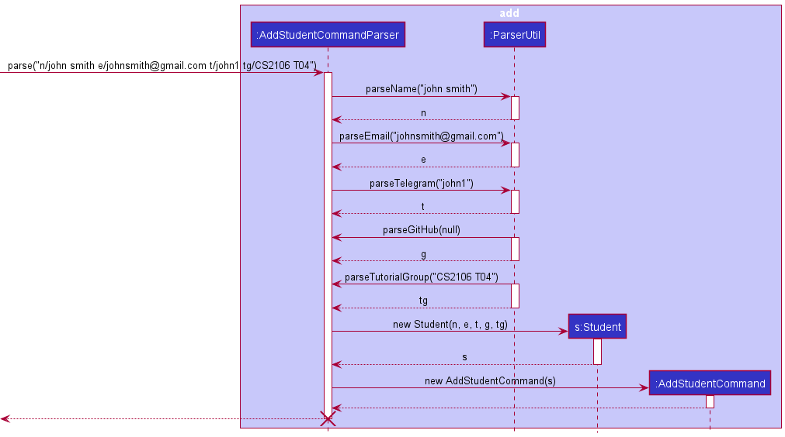
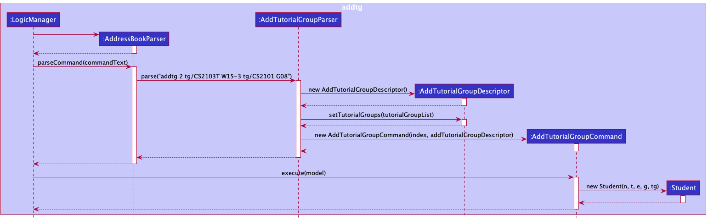
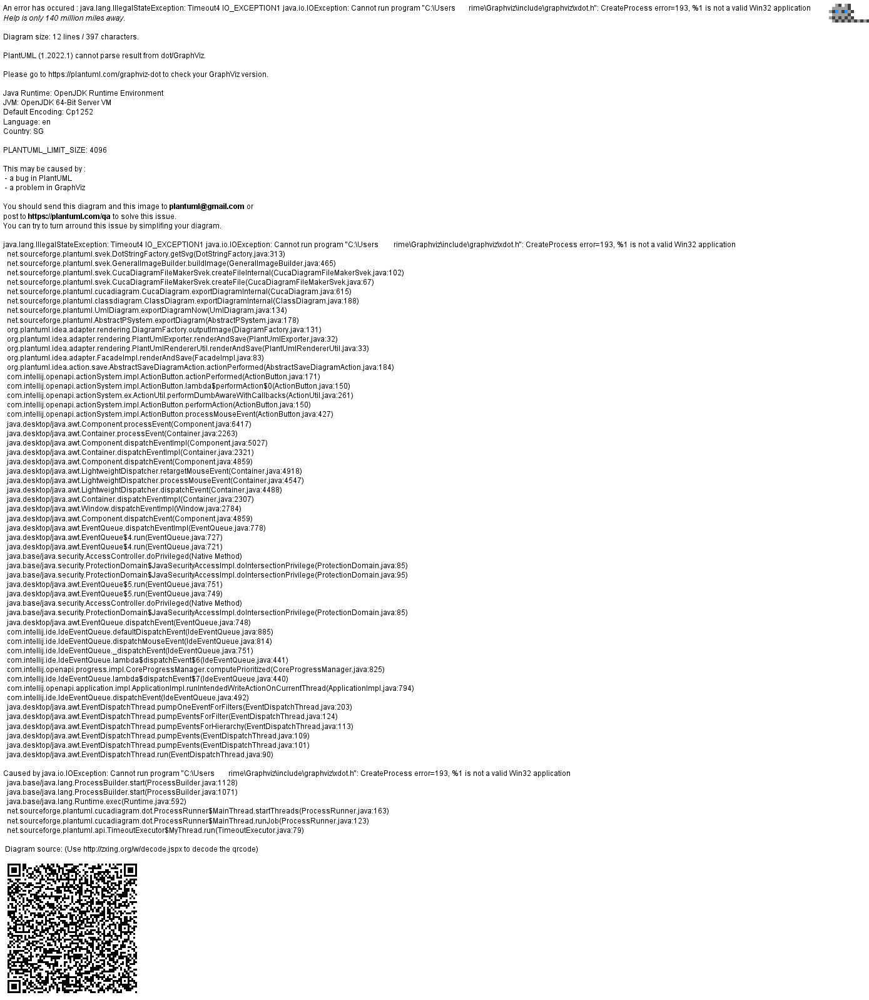
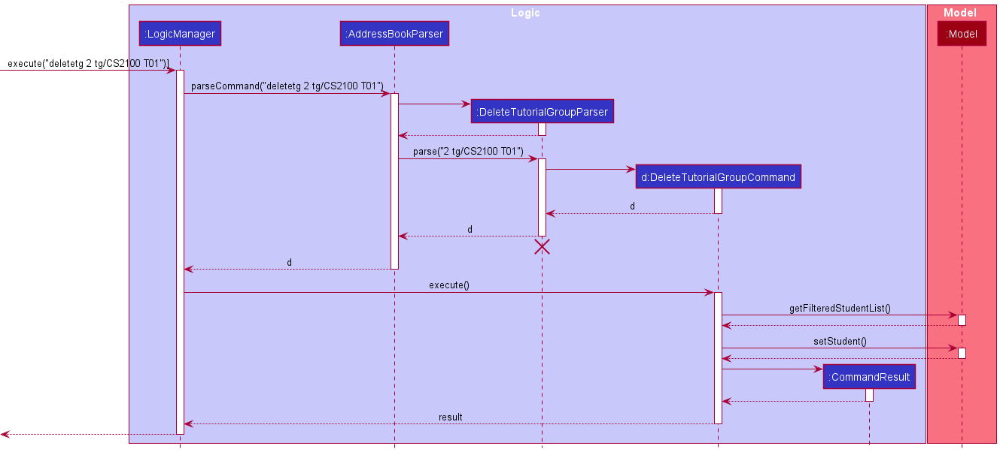
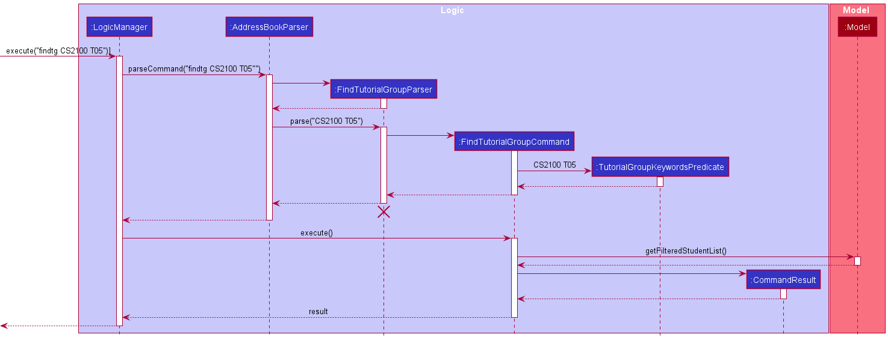

## Table of Contents

* Table of Contents
{:toc}

--------------------------------------------------------------------------------------------------------------------

## **Introduction**

TACH is a desktop application for Computer Science (CS) Teaching Assistants (TAs) in National University of Singapore (NUS) to manage their students. The 
application is highly optimised for users who can type fast as it is based on the Command Line Interface (CLI). Thus, 
the main interaction with TACH will be done through user text-based commands.

This developer’s guide assumes its readers to have a basic understanding of programming.

The purpose of this Developer Guide is to help readers understand the design and implementation of TACH, so that 
any reader who is interested can become a contributor to this project as well.

--------------------------------------------------------------------------------------------------------------------
## **Acknowledgements**

This project is based on the AddressBook-Level3(AB3) project created by the [SE-EDU initiative](https://se-education.org).

--------------------------------------------------------------------------------------------------------------------
## Navigation

Following are a few syntaxes to take note before proceeding with the rest of the contents in our developer guide:

| Syntax                                                             | Description                                                  |
|--------------------------------------------------------------------|--------------------------------------------------------------|
| `Markdown`                                                         | Denotes file path, distinct classes, their usage or examples |
| <div markdown="span" class="alert alert-info">:information_source: Note | Important information to take note of                        |
| Words in `UPPER_CASE`                                              | Parameters to be supplied by the user                        |
| parameter end with `…`                                             | This parameter can be added multiple times                                            |

--------------------------------------------------------------------------------------------------------------------

## **Setting up, getting started**

Refer to the guide [_Setting up and getting started_](SettingUp.md).

--------------------------------------------------------------------------------------------------------------------

## **Design**

<div markdown="span" class="alert alert-primary">

:bulb: **Tip:** The `.puml` files used to create diagrams in this document can be found in the [diagrams](https://github.com/AY2122S2-CS2103T-W15-3/tp/tree/master/docs/diagrams/) folder. Refer to the [_PlantUML Tutorial_ at se-edu/guides](https://se-education.org/guides/tutorials/plantUml.html) to learn how to create and edit diagrams.
</div>

### Architecture


The ***Architecture Diagram*** given above explains the high-level design of the App.

Given below is a quick overview of main components and how they interact with each other.

**Main components of the architecture**

**`Main`** has two classes called [`Main`](https://github.com/AY2122S2-CS2103T-W15-3/tp/tree/master/src/main/java/seedu/address/Main.java) and [`MainApp`](https://github.com/AY2122S2-CS2103T-W15-3/tp/tree/master/src/main/java/seedu/address/MainApp.java). It is responsible for,
* At app launch: Initializes the components in the correct sequence, and connects them up with each other.
* At shut down: Shuts down the components and invokes cleanup methods where necessary.

[**`Commons`**](#common-classes) represents a collection of classes used by multiple other components.

The rest of the App consists of four components.

* [**`UI`**](#ui-component): The UI of the App.
* [**`Logic`**](#logic-component): The command executor.
* [**`Model`**](#model-component): Holds the data of the App in memory.
* [**`Storage`**](#storage-component): Reads data from, and writes data to, the hard disk.


**How the architecture components interact with each other**

The *Sequence Diagram* below shows how the components interact with each other for the scenario where the user issues the command `delete 1`.


Each of the four main components (also shown in the diagram above),

* defines its *API* in an `interface` with the same name as the Component.
* implements its functionality using a concrete `{Component Name}Manager` class (which follows the corresponding API `interface` mentioned in the previous point.

For example, the `Logic` component defines its API in the `Logic.java` interface and implements its functionality using the `LogicManager.java` class which follows the `Logic` interface. Other components interact with a given component through its interface rather than the concrete class (reason: to prevent outside component's being coupled to the implementation of a component), as illustrated in the (partial) class diagram below.


The sections below give more details of each component.

### UI component

The **API** of this component is specified in [`Ui.java`](https://github.com/AY2122S2-CS2103T-W15-3/tp/tree/master/src/main/java/seedu/address/ui/Ui.java)


The UI consists of a `MainWindow` that is made up of parts e.g.`CommandBox`, `ResultDisplay`, `PersonListPanel`, `StatusBarFooter` etc. All these, including the `MainWindow`, inherit from the abstract `UiPart` class which captures the commonalities between classes that represent parts of the visible GUI.

The `UI` component uses the JavaFx UI framework. The layout of these UI parts are defined in matching `.fxml` files that are in the `src/main/resources/view` folder. For example, the layout of the [`MainWindow`](https://github.com/AY2122S2-CS2103T-W15-3/tp/tree/master/src/main/java/seedu/address/ui/MainWindow.java) is specified in [`MainWindow.fxml`](https://github.com/AY2122S2-CS2103T-W15-3/tp/tree/master/src/main/resources/view/MainWindow.fxml)

The `UI` component,

* executes user commands using the `Logic` component.
* listens for changes to `Model` data so that the UI can be updated with the modified data.
* keeps a reference to the `Logic` component, because the `UI` relies on the `Logic` to execute commands.
* depends on some classes in the `Model` component, as it displays `Person` object residing in the `Model`.

### Logic component

**API** : [`Logic.java`](https://github.com/AY2122S2-CS2103T-W15-3/tp/tree/master/src/main/java/seedu/address/logic/Logic.java)

Here's a (partial) class diagram of the `Logic` component:


How the `Logic` component works:
1. When `Logic` is called upon to execute a command, it uses the `AddressBookParser` class to parse the user command.
1. This results in a `Command` object (more precisely, an object of one of its subclasses e.g., `AddCommand`) which is executed by the `LogicManager`.
1. The command can communicate with the `Model` when it is executed (e.g. to add a person).
1. The result of the command execution is encapsulated as a `CommandResult` object which is returned back from `Logic`.

The Sequence Diagram below illustrates the interactions within the `Logic` component for the `execute("delete 1")` API call.


<div markdown="span" class="alert alert-info">:information_source: **Note:** The lifeline for `DeleteCommandParser` should end at the destroy marker (X) but due to a limitation of PlantUML, the lifeline reaches the end of diagram.
</div>

Here are the other classes in `Logic` (omitted from the class diagram above) that are used for parsing a user command:


How the parsing works:
* When called upon to parse a user command, the `AddressBookParser` class creates an `XYZCommandParser` (`XYZ` is a placeholder for the specific command name e.g., `AddCommandParser`) which uses the other classes shown above to parse the user command and create a `XYZCommand` object (e.g., `AddCommand`) which the `AddressBookParser` returns back as a `Command` object.
* All `XYZCommandParser` classes (e.g., `AddCommandParser`, `DeleteCommandParser`, ...) inherit from the `Parser` interface so that they can be treated similarly where possible e.g, during testing.

Go back to **[Table of Contents](#table-of-contents)**

### Model component
**API** : [`Model.java`](https://github.com/AY2122S2-CS2103T-W15-3/tp/tree/master/src/main/java/seedu/address/model/Model.java)


The `Model` component,

* stores the address book data i.e., all `Person` objects (which are contained in a `UniquePersonList` object).
* stores the currently 'selected' `Person` objects (e.g., results of a search query) as a separate _filtered_ list which is exposed to outsiders as an unmodifiable `ObservableList<Person>` that can be 'observed' e.g. the UI can be bound to this list so that the UI automatically updates when the data in the list change.
* stores a `UserPref` object that represents the user’s preferences. This is exposed to the outside as a `ReadOnlyUserPref` objects.
* does not depend on any of the other three components (as the `Model` represents data entities of the domain, they should make sense on their own without depending on other components)

<div markdown="span" class="alert alert-info">:information_source: **Note:** An alternative (arguably, a more OOP) model is given below. It has a `Tag` list in the `AddressBook`, which `Person` references. This allows `AddressBook` to only require one `Tag` object per unique tag, instead of each `Person` needing their own `Tag` objects.<br>


</div>


### Storage component

**API** : [`Storage.java`](https://github.com/AY2122S2-CS2103T-W15-3/tp/tree/master/src/main/java/seedu/address/storage/Storage.java)


The `Storage` component,
* can save both address book data and user preference data in json format, and read them back into corresponding objects.
* inherits from both `AddressBookStorage` and `UserPrefStorage`, which means it can be treated as either one (if only the functionality of only one is needed).
* depends on some classes in the `Model` component (because the `Storage` component's job is to save/retrieve objects that belong to the `Model`)

### Common classes

Classes used by multiple components are in the `seedu.addressbook.commons` package.

Go back to **[Table of Contents](#table-of-contents)**

--------------------------------------------------------------------------------------------------------------------

## **Implementation**

* [Telegram and GitHub attribute implementations](#telegram-and-github-attribute-implementations)
    * [How it works](#how-it-works)
    * [Why it works](#why-it-works)
    * [Design considerations regarding how empty GitHub and Telegram should be stored](#design-considerations-regarding-how-empty-github-and-telegram-should-be-stored)
* [`addtg` feature](#addtg-feature)
    * [How `addtg` command is parsed and executed](#how-addtg-command-is-parsed-and-executed)
    * [Example usage scenario and how the `addtg` mechanism behaves](#example-usage-scenario-and-how-the-addtg-mechanism-behaves)
* [`deletetg` feature](#deletetg-feature)
    * [How `deletetg` command is parsed and executed](#how-deletetg-command-is-parsed-and-executed)
    * [A few interesting details regarding how `deletetg` command works](#a-few-interesting-details-regarding-how-deletetg-command-works)
* [`findtg` feature](#findtg-feature)
    * [How `findtg` command is parsed and executed](#how-findtg-command-is-parsed-and-executed)
    * [Example usage scenario and how the `findtg` mechanism behaves](#example-usage-scenario-and-how-the-findtg-mechanism-behaves)

This section describes some noteworthy details on how certain features are implemented.

### Telegram and GitHub attribute implementations

The diagram below shows that a `Student` may or may not have a `Telegram` and a `Github`.


Students with empty
`GitHub` and `Telegram` are stored using `GitHub` and `Telegram` instantiated with empty strings as shown below.


#### How it works

Below is a sequence diagram for `addStudentCommand`. The command was implemented such that all inputs have to be parsed by the respective methods of `ParserUtil`.



>**Note:** parseGitHub and parseTelegram methods now accommodate null as inputs.<br/>
> Here is a snippet for parseGitHub. parseTelegram has a similar format as well.
> ```
> public static GitHub parseGitHub(String gitHub) throws ParseException {
>     if (gitHub == null) {
>         return new GitHub(null);
>     }
>     String trimmedGitHub = gitHub.trim();
>     if (!GitHub.isValidGitHub(trimmedGitHub)) {
>         throw new ParseException(GitHub.MESSAGE_CONSTRAINTS);
>     }
>     return new GitHub(trimmedGitHub);
> }
> ```

GitHub and Telegram objects instantiated with null inputs have a value of ""
Here is a snippet for the constructor of Telegram. GitHub also have a similar format.
```
public Telegram(String telegram) {
    if (telegram == null) { //if telegram is empty it will exist as an empty string
        value = "";
    } else {
        checkArgument(isValidTelegram(telegram), MESSAGE_CONSTRAINTS);
        value = telegram;
    }
}
```

This means that an empty `GitHub` object will have a "" value and a `GitHub` object with a value of "" means that it is an empty `GitHub` object. The same logic applies to `Telegram` objects as well.

#### Why it works

As shown in the previous sequence diagram, `ParserUtil` parses all the inputs for the add command. Thus, an empty string (i.e. "") will be parsed though the method isValidXX, where XX is an attribute i.e. isValidName. All empty string will throw an error in any of parse methods in `ParserUtil`. Thus, an empty string will never be able to be accepted through the user input. Therefore, an empty string was used as a means to identify and instantiate attributes that can be empty (e.g. GitHub and Telegram).

#### Design considerations regarding how empty GitHub and Telegram should be stored

* Alternative 1: Stored as null
  * Pros: Easy to implement
  * Cons: NullPointerException can occur if `.toString()`of null is called

* Alternative 2: Stored as a reserved valid string e.g. "null"
  * Pros: Avoid NullPointerExceptions
  * Cons: Possibility of a student whose telegram and github be the string "null".

* Alternative 3 (Current Choice): Stored as an invalid string i.e. ""
  * Pros: Avoid NullPointerExceptions
  * Cons: We must ensure that the conversion from Object to Json and vice-versa must be correct.

### `addtg` feature

The `addtg` command adds tutorial group(s) to a student

The *add tutorial group(s) to a student* mechanism is facilitated by the `LogicManager` and the `AddressBookParser`. It is implemented by adding the parser class `AddTutorialGroupParser` and the command class `AddTutorialGroupCommand`.

```
command format: addtg INDEX tg/TUTORIAL_GROUP...
```
#### How `addtg` command is parsed and executed

Assuming the command is valid and execution is successful,

1. `LogicManager` is called to execute the command, using the `AddressBookParser` class to parse the
   command.
2. `AddressBookParser` sees that the command has the valid starting command word `addtg` and creates a
   new `AddTutorialGroupParser` that parses the command.
3. `AddTutorialGroupParser` confirms the command is valid and returns a `AddTutorialGroupCommand` to
   be executed by the `LogicManager`
4. `LogicManager` executes `AddTutorialGroupCommand`, which gets the relevant information from the
   `Model` component, getting the filtered student list and acquiring the student at the specified `Index`.
5. `AddTutorialGroupCommand` creates a new `Student` combining the existing and newly specified `TUTORIAL_GROUP(s)` and returns the relevant `CommandResult` to `LogicManager`

Rationale:
- A new `Student` is created with the new combined information instead of adding the new tutorial group(s) to the existing `Student` is because a `Student` object is immutable.
- An `Index` based on the current list shown is used to specify which `Student` will be updated. An alternative would be to use the name of the student instead of an index. However, an index makes it easier and faster for users to key in the command as it is way shorter (length) as compared to a student's name.
  - Hence, to increase efficiency of TACH, we have chosen `index` to be our indicator.

#### Example usage scenario and how the `addtg` mechanism behaves

When the user executes `addtg 2 tg/CS2103T W15-3 tg/CS2101 G08` command to add a tutorial group to the 2nd person listed in the address book.

The following sequence diagram shows how the `addtg` operation works:



The following diagram shows a brief overview of the AddTutorialGroupDescriptor created shown in the `addtg` sequence diagram above



Go back to **[Table of Contents](#table-of-contents)**

### `deletetg` feature

The `deletetg` command deletes a tutorial group from a student.

The *deleting a tutorial group from student* mechanism is facilitated by the `LogicManger` and the
`AddressBookParser`. It is implemented by adding the parser class `DeleteTutorialGroupParser` and the
command class `DeleteTutorialGroupCommand`.

```
command format: deletetg INDEX tg/TUTORIAL_GROUP
```

#### How `deletetg` command is parsed and executed

Assuming the command is valid and execution is successful,

1. `LogicManager` is called to execute the command, using the `AddressBookParser` class to parse the
command.
2. `AddressBookParser` sees that the command has the valid starting command word `deletetg` and creates a
new `DeleteTutorialGroupParser` that parses the command.
3. `DeleteTutorialGroupParser` confirms the command is valid and returns a `DeleteTutorialGroupCommand` to
be executed by the `LogicManager`
4. `LogicManager` executes `DeleteTutorialGroupCommand`, which gets the relevant information from the
`Model` component, getting the filtered student list and acquiring the student at the specified `Index`.
5. `DeleteTutorialGroupCommand` deletes the specified `TUTORIAL_GROUP` of the student and returns the relevant `CommandResult` to `LogicManager`

Sequence Diagram:



<br>

This feature was implemented to follow this sequence to keep it consistent with the rest of the `Command`s
and `Parser`s.

#### A few interesting details regarding how `deletetg` command works

- The command takes in an `Index` instead of a student's name because we felt that it was much easier to
type in a number than the entirety of someone's name. It is also distinct and much less vague.


- Only one tutorial group can be deleted at a time. If a person has some tutorial groups but not all
tutorial groups to be deleted, what should the command do? Making it such that only one tutorial group can
be deleted at a time prevents ambiguity in contrast to if several tutorial groups can be deleted at a time.


- If the tutorial group to be deleted is the only one that the student has, the command will not work. A
student must have at least one tutorial group. If this were not the case, it could result in some serious
buggy behaviours regarding other commands involving tutorial groups.


- The tutorial group must be typed exactly, but is case-insensitive. <br> An alternative would be to
indicate an `Index` instead of the exact tutorial group, but that would mean we would either have to
display an overall index of all the modules, or display an index of all the modules for each student.
Either way it would make the UI more complex and cluttered. <br> This is why we decided to make it such
that it must be typed exactly, but is case-insensitive, since two tutorial groups should be the same if
only their cases are different.

### `findtg` feature

The `findtg` command will list all students in a particular tutorial group.

The *find a tutorial group* mechanism is facilitated by the `LogicManger` and the
`AddressBookParser`. It is implemented by adding the parser class `FindTutorialGroupParser`, the
command class `FindTutorialGroupCommand` and the model class `TutorialGroupKeywordsPredicate`.

```
command format: findtg TUTORIAL_GROUP
```

#### How `findtg` command is parsed and executed

Assuming the command is valid and execution is successful,

1. `LogicManager` is called to execute the command, using the `AddressBookParser` class to parse the
   command.
2. `AddressBookParser` sees that the command has the valid starting command word `findtg` and creates a
   new `FindTutorialGroupParser` that parses the command.
3. `FindTutorialGroupParser` confirms the command is valid and returns a `FindTutorialGroupCommand` to
   be executed by the `LogicManager`
4. `FindTutorialGroupCommand` passes the specified `TUTORIAL_GROUP` name to `TutorialGroupKeywordsPredicate` to 
filter out all students with the specified `TUTORIAL_GROUP` name
5. `LogicManager` executes `FindTutorialGroupCommand`, which gets the relevant information from the
   `Model` component, getting the filtered student list.
6. `FindTutorialGroupCommand` filter out all students in the specified `TUTORIAL_GROUP` and returns the relevant 
`CommandResult` to `LogicManager`

#### Example usage scenario and how the *findtg* mechanism behaves

When the user executes `findtg CS2100 T05` command to find a tutorial group.

The following sequence diagram shows how the `findtg` operation works:



There are a few interesting details as to how the command works:

- The tutorial group must be typed exactly, but is case-insensitive. Since it is more convenience for user to type and
  two tutorial groups should be the same if only their cases are different.

- If there are no matching tutorial group found in the students, the command will return an empty student list

- `findtg` do not support find partial keyword to prevent ambiguity and TAs usually teach a single module with multiple
tutorial group. This operation is provided for users to sort students by their specified tutorial group

Go back to **[Table of Contents](#table-of-contents)**

--------------------------------------------------------------------------------------------------------------------

## **Documentation, logging, testing, configuration, dev-ops**

* [Documentation guide](Documentation.md)
* [Testing guide](Testing.md)
* [Logging guide](Logging.md)
* [Configuration guide](Configuration.md)
* [DevOps guide](DevOps.md)

--------------------------------------------------------------------------------------------------------------------

## **Appendix: Requirements**

### Product scope

**Target user profile**:

* is a Computer Science (CS) Teaching Assistant (TA) in NUS
* is teaching multiple Computer Science modules/tutorial groups
* has a need to manage a significant number of students
* prefer desktop apps over other types
* can type fast
* prefers typing to mouse interactions
* is reasonably comfortable using CLI apps

**Value proposition**: TACH helps CS Teaching Assistants teaching multiple tutorial groups to manage
their students in an organized manner. Our sorting feature will allow TAs to view, categorize
and get information of all their students at one glance.


### User stories

Priorities: High (must have) - `* * *`, Medium (nice to have) - `* *`, Low (unlikely to have) - `*`

| Priority | As a …​                        | I want to …​                                                                          | So that I can …​                                                                  |
|----------|-------------------------------------------|---------------------------------------------------------------------------------------|-----------------------------------------------------------------------------------|
| `* * *`  | CS TA                                     | add a student                                                                         | keep track of them and their contacts                                             |
| `* * *`  | CS TA                                     | add a tutorial group to a student                                                     | identify which tutorial groups a student is taking                                |
| `* * *`  | CS TA                                     | delete a student                                                                      | make sure I have the correct student in the list                                  |
| `* * *`  | CS TA                                     | delete a tutorial group from a student                                                | make sure a student has the correct tutorial groups                               |
| `* * *`  | CS TA                                     | delete a tutorial group from all students                                             | remove non-existing tutorial groups at the end of a semester easily               |
| `* * *`  | CS TA                                     | find students by name                                                                 | contact the appropriate student                                                   |
| `* * *`  | CS TA using the application               | see all the students' contact information that I stored                               |                                                                                   |
| `* * *`  | CS TA                                     | get my students' private contact details like their email, Telegram and GitHub easily | can save time from the convenience of having all the contact details in one place |
| `* * *`  | CS TA who is experienced in CLI programs  | type everything in one command at one go                                              | manage things in the application more quickly                                     |
| `* * *`  | CS TA new to the application              | be able to find a user guide for the application                                      | refer to it when needed                                                           |
| `* * *`  | CS TA using the application               | be able to exit the application                                                       |                                                                                   |
| `* * `   | CS TA                                     | sort my students by tutorial groups                                                   | find the appropriate students for my tutorial groups easily                       |
| `* * `   | CS TA                                     | sort my students by name                                                              | easily find someone if I forgot part of their name                                |
| `* * `   | CS TA                                     | find students by a tutorial group                                                     | see which students are in that tutorial group                                     |
| `* * `   | CS TA                                     | undo my mistakes                                                                      |                                                                                   |
| `* *`    | CS TA                                     | redo my mistakes                                                                      |                                                                                   |
| `* *`    | CS TA                                     | store zoom link and venue of tutorial session                                         | find them easily when it is time for tutorial                                     |
| `* *`    | CS TA that finished a semester            | clear my student contact list                                                         | easily start afresh for the next semester                                         |
| `* *`    | Forgetful TA                              | store timing of the tutorial session                                                  | find them easily when I lose track of time                                        |
| `* *`    | CS TA                                     | keep track of the assignments submitted by students                                   | mark accordingly                                                                  |
| `* `     | CS TA                                     | send group messages to a specific group of students                                   | make announcements effectively                                                    |
| `* `     | CS TA                                     | see the announcements that I have sent to the students in a tutorial group            |                                                                                   |
| `* `     | Busy TA                                   | set an alarm before the tutorial starts                                               | be on time for tutorial session                                                   |


Go back to **[Table of Contents](#table-of-contents)**

### Use cases

(For all use cases below, the **System** is the `Teaching Assistant Contact Helper (TACH)` and the **Actor** is the `Teaching Assistant (TA)`, unless specified otherwise)

**Use case: UC01 - Add a student**

**MSS:**

1. TA adds a new student to the contact list by giving their name, their email and their tutorial group
2. Student successfully added to the list

    Use case ends.

**Extensions**

* 1a. The command has an invalid name, email and/or tutorial group.
  * 1a1. TACH prompts the TA to type in the valid parameters.
  Step 1a1 is repeated until the data entered is correct.

    Use case resumes from step 2.


* 1b. The command does not have a name, email and/or tutorial group.
    * 1b1.  TACH prompts the TA to add in the valid parameters.
    Step 1b1 is repeated until the data entered is correct.

      Use case resumes from step 2.
<br><br>

**Use case: UC02 - Add a tutorial group to a student**

**MSS:**

1. TA adds a new tutorial group to a student by giving the relevant tutorial group.
2. The new tutorial group is successfully added to the student.

    Use case ends.

**Extensions**

* 1a. The command has an invalid tutorial group.
  * 1a1. TACH prompts the TA to type in a valid tutorial group.
  Step 1a1 is repeated until a valid tutorial group is entered.

    Use case resumes from step 2.

* 1b. The command has an invalid student or a student that does not exist in the contact list.
  * 1b1. TACH prompts the TA to type in a valid student.
  Step 1b1 is repeated until a valid student is entered.

    Use case resumes from step 2.
<br><br>

**Use case: UC03 - Delete a student**

**MSS:**

1.  TA requests to view all students.
2.  TACH shows a list of students.
3.  TA requests to delete a specific student in the list by their index on the list.
4.  TACH deletes the student from the tutorial group.

    Use case ends.

**Extensions**

* 1a. The student list is empty. There are no students that can be deleted.

  Use case ends.

* 1b. TA chooses instead to find students from a specific tutorial group.

  Use case resumes at step 2.

* 3a. The given index is invalid.
  * 3a1. TACH prompts the TA to type in a valid index.
  Step 3a1 is repeated until a valid index is entered.

  Use case resumes at step 4.
<br><br>

**Use case: UC04 - Delete a tutorial group from a student**

**MSS:**

1. TA requests to delete a tutorial group from a student.
2. The tutorial group is successfully deleted from the student.

    Use case ends.

**Extensions**

* 1a. The tutorial group requested is an invalid tutorial group or the student is not under that tutorial group.
  * 1a1. TACH prompts the TA to type a valid tutorial group.
  Step 1a1 is repeated until a valid tutorial group is entered.
  
* 1b. The tutorial group requested to be deleted is the only tutorial group the student has.
  * 1b1. TACH notifies the TA that the tutorial group cannot be deleted.

    Use case ends.
<br><br>

**Use case: UC05 - Find students from a tutorial group**

**MSS:**

1. TA requests to find a tutorial group.
2. TACH list out all the students from the tutorial group.

   Use case ends.

**Extensions**

* 1a. The tutorial group entered is not found in any student.
    * 1a1. TACH prompts that there is 0 student in the list.

  Use case ends.
<br><br>

**Use case: UC06 - Clearing all students**

**MSS:**

1. TA chooses to clear all students from their contact list.
2. TACH completely clears its list.

    Use case ends.
<br><br>

**Use case: UC07 - Delete a tutorial group from all students**

**MSS:**

Similar to UC04 except that it applies to all students under that tutorial group instead.

**Extensions**

*1a. The tutorial group requested is an invalid tutorial group.
 *1a1. TACH prompts the TA to type a valid tutorial group.
Step 1a1 is repeated until a valid tutorial group is entered.

*1b. The tutorial group requested to be deleted is the only tutorial group the student has.
 * 1b1. TACH deletes the tutorial group from the student.
 * 1b2. The student with no tutorial groups remaining afterwards will be deleted. 
Steps 1b1 - 1b2 are repeated until the requested tutorial group is removed from all the students under it.
<br><br>

**Use case: UC08 - Get user guide**

**MSS:**

1. TA requests for the user guide.
2. TACH provides the link to the user guide.

   Use case ends.
<br><br>

**Use case: UC09 - Exit TACH**

**MSS:**

1. TA requests to exit TACH.
2. TACH closes.

   Use case ends.
<br><br>

**Use case: UC10 - See list of all students**

**MSS:**

1. TA request to see list of all students in TACH.
2. TACH displays the list of all students that are stored.

   Use case ends.
<br><br>

**Use case: UC11 - Find a student**

**MSS:**

1. TA requests to find a student.
2. TACH list out all the students that was requested. 

   Use case ends.
<br><br>

**Use case: UC12 - Edit a student**

**MSS:**

1. TA requests to edit information of a specific student in the list by their index on the list.
2. TACH updates the student specified by the index with the information provided by TA

    Use case ends.

**Extensions**

* 1a. TA chooses instead to find students from a specific tutorial group.

  Use case resumes at step 2.

* 1a. The given index is invalid.
    * 1a1. TACH prompts the TA to type in a valid index.
      Step 1a1 is repeated until a valid index is entered.

* 1b. The email/telegram/github/name, that is provided, is invalid.
    * 1b1. TACH prompts the TA to type in a valid attribute for the attribute that is invalid.
      Step 1b1 is repeated until the provided attributes are valid.
* 1c. The tutorial group ,if provided, is empty or invalid
    * 1c1. TACH prompts the TA to type in a non-empty and valid tutorial group.
      Step 1c1 is repeated until the tutorial group is valid and non-empty.
  Use case resumes at step 2.
  <br><br>

Go back to **[Table of Contents](#table-of-contents)**

### Non-Functional Requirements

1. Should work on any _mainstream OS_ as long as it has Java `11` or above installed.
2. Should be able to hold up to `1000` persons without a noticeable sluggishness in performance for typical usage.
3. The system should respond within two seconds.
4. A user with above average typing speed for regular English text (i.e. not code, not system admin commands)
should be able to accomplish most of the tasks faster using commands than using the mouse.
5. The user interface should be easy to understand for beginner users.
6. The commands should feel intuitive and easy to pick up and remember to a beginner user.
7. The source code should be open source.
8. The product is free and ready-to-use as soon as one downloads it.
9. The product should work offline, without an Internet connection.

### Glossary

* **Tutorial Group**: Tutorial Group is synonymous with "(Tutorial) Class", we use the term Tutorial Group in our code
and documentation to prevent it from being confused with "Java Classes".
* **Mainstream OS**: Windows, Linux, Unix, OS-X
* **Private contact detail**: A contact detail that is not meant to be shared with others
* **API**: An application programming interface (API) is the medium by which different software interact
* **Interface**: An abstract type that is used to specify a behavior of certain tutorial groups
* **System admin commands**: Terminal commands such as `pwd`, `ls`, `tar`
* **Open source**: Open source code is publicly accessible to everyone to read, modify and distribute

--------------------------------------------------------------------------------------------------------------------

## **Appendix: Instructions for manual testing**

Given below are instructions to test the app manually.

<div markdown="span" class="alert alert-info">:information_source: **Note:** These instructions only provide a starting point for testers to work on;
testers are expected to do more *exploratory* testing.

</div>

### Launch and shutdown

1. Initial launch

   1. Download the jar file and copy into an empty folder

   1. Double-click the jar file Expected: Shows the GUI with a set of sample contacts. The window size may not be optimum.

1. Saving window preferences

   1. Resize the window to an optimum size. Move the window to a different location. Close the window.

   1. Re-launch the app by double-clicking the jar file.<br>
       Expected: The most recent window size and location is retained.

### Deleting a person

1. Deleting a student while all students are being shown

   1. Prerequisites: List all students using the `list` command. Multiple students in the list.

   1. Test case: `delete 1`<br>
      Expected: First student is deleted from the list. Details of the deleted student shown in the status message. Timestamp in the status bar is updated.

   1. Test case: `delete 0`<br>
      Expected: No student is deleted. Error details shown in the status message. Status bar remains the same.

   1. Other incorrect delete commands to try: `delete`, `delete x`, `...` (where x is larger than the list size)<br>
      Expected: Similar to previous.

### Finding a tutorial group

1. Finding students from a particular tutorial group while all students are being shown
   1. Prerequisites: Multiple students are added to a tutorial group eg:`CS2103T W15`.

   2. Test case: `findtg CS2103T W15`<br>
      Expected: all students added to the tutorial group `CS2103T W15` are listed out. Number of students listed out are shown in the status message.

   3. Test case: `findtg CS2103T`<br>
      Expected: No student listed. Since user only input module code without tutorial group details. All invalid entry of tutorial group or no matching tutorial group will result in no student listed.

### Dealing with corrupted data files

1. Troubleshooting with corrupted files:
   1. Prerequisite: Corrupted data file.
       * To simulate a corrupted data file:
         1. Open the data folder in the folder where TACH is in. Edit TACH.json and change one of the fields to an invalid one e.g. change from
             > "name" : "Irfan Ibrahim",
             <br>"telegram" : "@irfan201",
             <br>"email" : "irfan@hotmail.com",
             <br>"gitHub" : "",
             <br>"inTutorialGroups" : [ "CS2106 T01" ]

            to
            > "name" : "Irfan Ibrahim",
            <br>"telegram" : "@irfan201",
            <br>"email" : "irfan@hotmail.com!",
            <br>"gitHub" : "",
            <br>"inTutorialGroups" : [ "CS2106 T01" ]
      
            > **NOTE:** If there is no data file, open TACH and enter the command `list`. The data file should appeared in the folder where TACH is in.
   2. Test case: Corrupted data file 
   <br>Open the data folder in the folder where TACH is in. Edit all the data such that it meets the requirement stated here.[Input Requirements](https://ay2122s2-cs2103t-w15-3.github.io/tp/UserGuide.html#input-requirements) 
   <br> Expected: TACH will now load the data file and not an empty one.
      1. Example: To resolve the issue in step i, change Irfan's email to a valid one. i.e.
         <br>change:
          > "name" : "Irfan Ibrahim",
          <br>"telegram" : "@irfan201",
          <br>"email" : "irfan@hotmail.com!",
          <br>"gitHub" : "",
          <br>"inTutorialGroups" : [ "CS2106 T01" ]
   
         to
         > "name" : "Irfan Ibrahim",
         <br>"telegram" : "@irfan201",
         <br>"email" : "irfan@hotmail.com",
         <br>"gitHub" : "",
         <br>"inTutorialGroups" : [ "CS2106 T01" ]

Go back to **[Table of Contents](#table-of-contents)**


