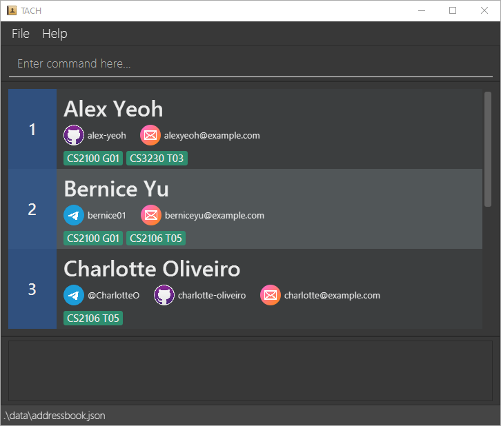
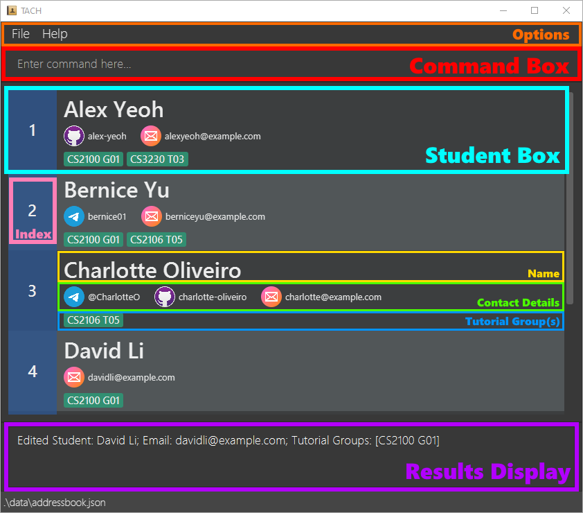
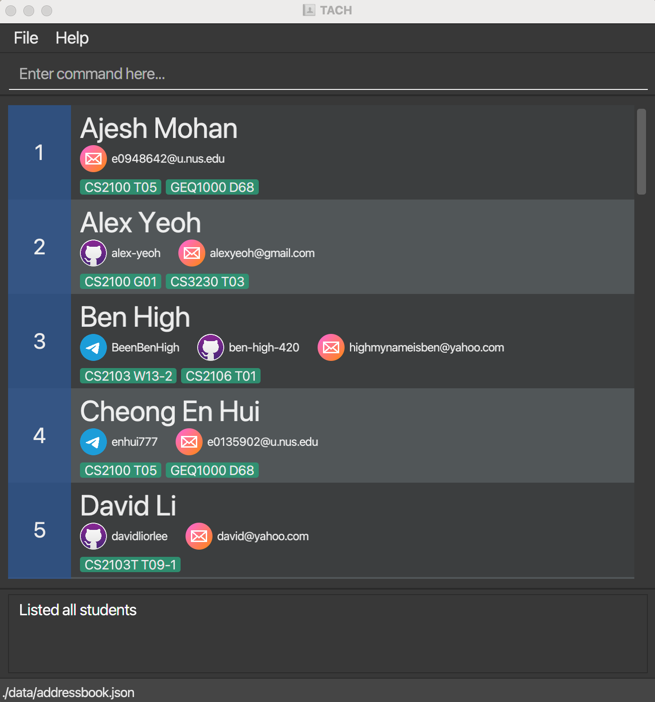
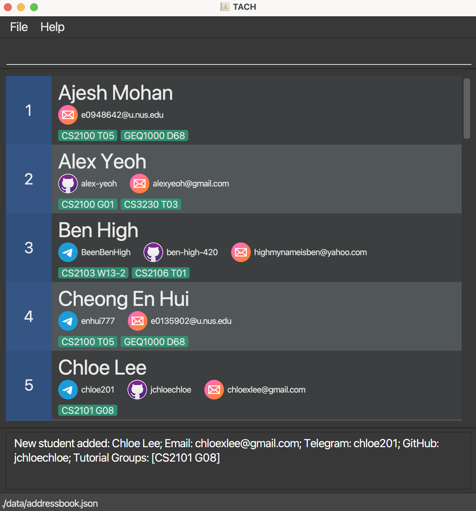
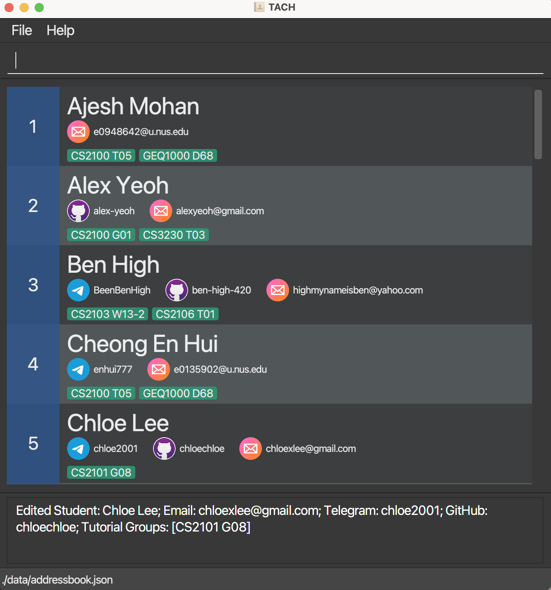
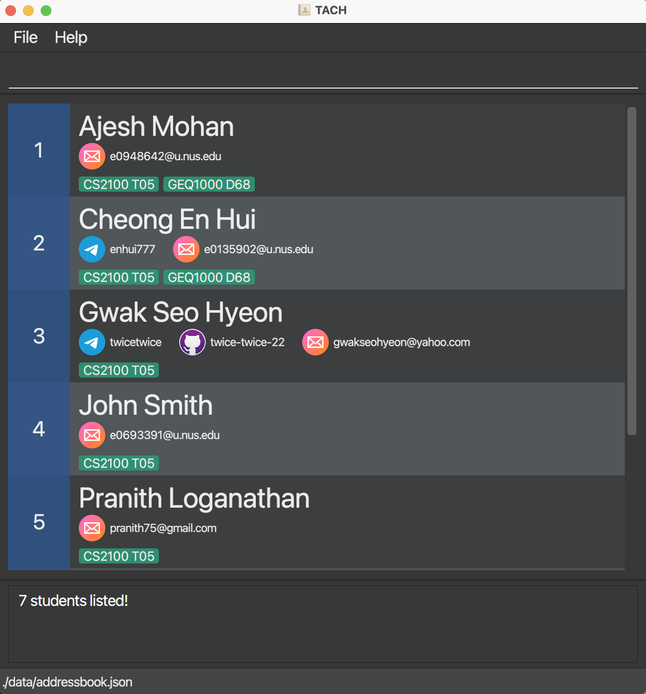
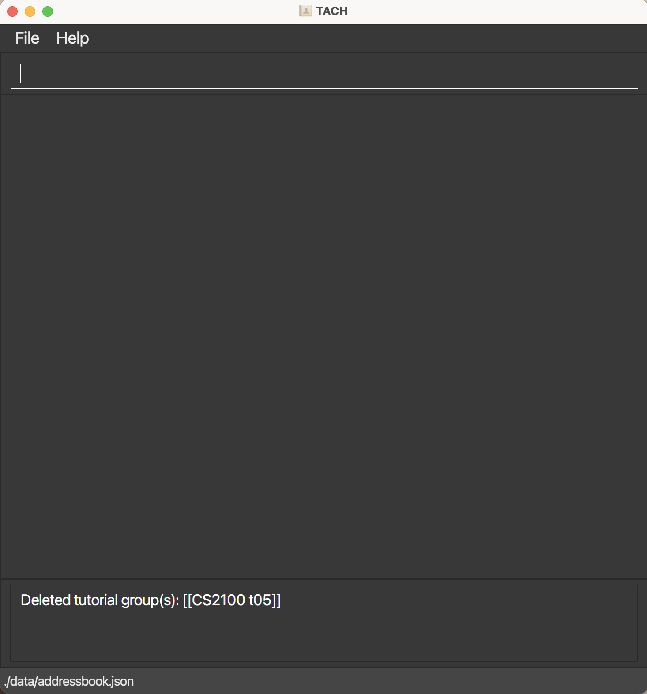

## Introduction

TACH is a desktop app that helps Computer Science (CS) Teaching Assistants (TAs) tutoring multiple tutorial groups by
**managing their students in an organised manner**.

TAs can **add, edit and delete** students and their tutorial groups from their list easily.
TAs can also **find** students by their name or by their tutorial group.

TACH automatically sorts students in alphabetical order, and all the students' contact details are right next to
their names, so that you can get their details in a glance, and you easily know which contacts belong to whom.

TACH works by typing what you want to do as commands. It is optimized for keyboard users, so if you can type fast,
TACH can work even faster.

## How to use this guide

**The goal of this guide is to help you**, the reader, to **understand how to use our app better**, regardless of
whether you are a new user or an experienced user.

If you are a new user and want to learn how to download and set up the app, go to **[Quick Start](#quick-start)**.
 If you have already installed the app and want to learn the basics, go to **[Quick Tutorial](#quick-tutorial)**.

If you are an experienced user who wants to use the app to its full potential, or you just want a quick refresher on
the commands, you can look at all the commands for TACH via **[Commands](#commands)**.

--------------------------------------------------------------------------------------------------------------------

## Table of Contents

* Table of Contents
{:toc}
  
--------------------------------------------------------------------------------------------------------------------

## Quick Start

1. Ensure you have **[Java 11](https://www.oracle.com/java/technologies/downloads/#java11-windows)** or above installed in your Computer.

2. Download the latest release of `TACH.jar` **[here](https://github.com/AY2122S2-CS2103T-W15-3/tp/releases)**.

3. Copy the file to the folder you want to use as the _home folder_ for your TACH.

4. Double-click the file to start the app. The app should appear in a few seconds and look similar to the image below. Note how the app contains some sample data.  
   

**:information_source: Note:** 

* You can **resize** the app by clicking and dragging the edges of the window to see more users at a time.
You can also **maximise** the window.

You're ready to start using TACH! You can continue learning how to use TACH through the
**[Quick Tutorial](#quick-tutorial)**.

On the other hand, if you're feeling confident, you can dive straight into all the **[Commands](#commands)**.

--------------------------------------------------------------------------------------------------------------------

## Quick Tutorial

This quick tutorial will teach you how to navigate through the app and its components, and some basic commands
that you can use right now!

### App Components

Here is a quick summary of all the components of the app:
  (Remember that you can **resize the window**!)

-  **Options**: Various options that you can use for the app.

-  **Command Box**: **The place where you type your commands.** Press the
**⏎Enter** key on your keyboard to submit your commands.

-  **Student Box**: Represents a student and all their details. It has
an index, the student's name, their contact details, and their tutorial group(s).

-  **Index**: A number showing where the student is positioned in the current list.

-  **Name**: The student's name.

-  **Contact Details**: The student's contact details.
  - The student must have an  **Email**,
but their  **Telegram** and  **GitHub** usernames
can be optional.

-  **Tutorial Group(s)**: The student's tutorial group(s). The student
must have at least one tutorial group.

-  **Results Display**: Displays the results of a successful command,
or an appropriate error message if the command is invalid.

### Quick Command Tutorial

Now that you know what each of the components are, it's time to learn a few commands! Commands will look like
**`this`**. Type the following commands exactly into the command box and press the **⏎Enter** key to submit
your command. The effect of the command is described after the command.

1. **`list`** : Lists all the students in TACH.
  
2. **`add n/Carl Sagan e/carlsagan42@gmail.com tg/CS2100 G01`** : Adds the student "Carl Sagan" with their email
and tutorial group to TACH. They should appear as the 3rd person (Index 3) on the list.
  
3. **`delete 2`**: Deletes the 2nd person in the displayed list. In this tutorial, "Bernice Yu" should be deleted
from the list.
  
4. **`find david`**: Finds all students that have "David" in their name. In this tutorial, only "David Li" should
be visible to you.
  
5. **`edit 1 n/David Lee t/DavidLee777 g/david-lee`** : Edits the 1st person in the visible list by changing
their name, their Telegram and their GitHub. In this tutorial, this should edit "David Li" to "David Lee" and
add their Telegram and GitHub usernames.
 The app should now display all the students, and you should be able to see "David Lee" as the 4th student with
their Telegram and GitHub added.
  
6. **`findtg cs2106 t05`** : Finds all students that have "CS2106 T05" as a tutorial group. In this tutorial,
you should see 3 students that have "CS2106 T05" as their tutorial group.
  
7. **`list`** : Lists all the students in TACH again.
  
8. **`deletetgall tg/cs2106 t05`** : Deletes the tutorial group "CS2106 T05" from every student. Students that
have no tutorial groups afterwards will be deleted as well. In this tutorial, you should see that "CS2106 T05"
is nowhere to be found, and the student "Charlotte Oliveiro" is deleted since they no longer have any
tutorial groups.
  
9. Experiment with some commands! Try out the same commands but with different formats, or you can take a look at
**[Commands](#commands)** for a few more commands that are not covered in this tutorial. When you're ready,
you can move on to the next two easy commands to complete the tutorial.
  
10. **`clear`** : Clears TACH of all students.
  
11. **`exit`** : Exits the app.

This completes the command tutorial! You're now ready to start adding your own students!

**:information_source: Note about reloading sample students:** 

If you ever get stuck or want to try out the tutorial again, follow these instructions to reload the
sample students into the app.

1. Exit the app.
2. Go to the folder that TACH is in.
3. Delete the `data` folder.
4. Reopen the app again.

The app should give back the original sample students for you to try out commands again!

Congratulations! You've learned what each component in the app is, and some basic commands that you can use right now
to get started! If you want more details on what each command does, you can refer to **[Commands](#commands)** for
a better understanding.   

Go back to **[Table of Contents](#table-of-contents)**

--------------------------------------------------------------------------------------------------------------------

## Commands

List of commands:
* [Viewing help](#viewing-help--help)
* [Listing students](#listing-all-students-list)
* [Adding](#adding)
     - [Adding a student](#adding-a-student-add)
     - [Adding a tutorial group](#adding-a-tutorial-group-for-a-student-addtg)
* [Editing a student](#editing-a-student--edit)
* [Finding](#finding)
     - [Finding students by name](#finding-students-by-name-find)
     - [Findind students by tutorial group](#finding-students-by-tutorial-group-findtg)
* [Deleting](#deleting)
     - [Deleting a student](#deleting-a-student-delete)
     - [Deleting a tutorial group from a student](#deleting-a-tutorial-group-from-a-student-deletetg)
     - [Deleting a tutorial group from all students](#deleting-tutorial-groups-from-all-students-deletetgall)
* [Clearing all entries](#clearing-all-entries--clear)
* [Exiting the program](#exiting-the-program--exit)

**:information_source: Notes about the command format:**

* Words in `UPPER_CASE` are the parameters to be supplied by the user.  
  e.g. in `add n/NAME`, `NAME` is a parameter which can be used as `add n/John Doe`. 

* Items in square brackets are optional.  
  e.g. `e/EMAIL [t/TELEGRAM]` can be used as `e/e0123456@u.nus.edu t/JohnSmith` or as `e/e0123456@u.nus.edu`  

* Items with `…` after them can be added multiple times.  
  e.g. `tg/TUTORIAL_GROUP…` can be used as `tg/CS2103 W15-3`, `tg/CS2103 W15-3 tg/CS2100 G08` etc.  

* Parameters can be in any order.  
  e.g. if the command specifies `n/NAME e/EMAIL`, `e/EMAIL n/NAME` is also acceptable.  

* Extraneous parameters for commands that do not take in parameters (such as `help`) will be ignored.  
  e.g. if the command specifies `help 123`, it will be interpreted as `help`.  
  - `help123` will not be interpreted as `help`.  
  
* `INDEX` represents the corresponding student currently displayed in TACH, and it has to be a positive integer. 

### Viewing help : `help`

Shows a message explaining how to access the help page.

Format: `help`

### Listing all students: `list`

Shows a list of all students in TACH.

Format: `list`

The students will be sorted in alphabetical order by their names.

### Adding 

#### Adding a student: `add`

Adds a student into TACH.

Format: `add n/NAME e/EMAIL [t/TELEGRAM] [g/GITHUB] tg/TUTORIAL_GROUP…`

Examples:
* `add n/John Doe tg/CS2100 G08 e/e0123456@u.nus.edu`
* `add n/Michael Tay e/michaelT@gmail.com t/MichaelTay g/michael777 tg/CS2103T W15-3 tg/CS2100 G08`

The following diagram shows the output for the following input:  
`add n/Chloe Lee e/chloexlee@gmail.com t/chloe201 g/jchloechloe tg/CS2101 G08`

  

#### Adding a tutorial group for a student: `addtg`

Adds a tutorial group for a student already in TACH.

Format: `addtg INDEX tg/TUTORIAL_GROUP…`

* Adds a tutorial group for the student at the specified `INDEX`. The index refers to the index number
shown in the current displayed student list. The index **must be a positive number** 1, 2, 3, …
* Adding of tutorial groups is cumulative; existing tutorial groups of the specified student will
remain unchanged.

Example:
* `list` followed by `addtg 2 tg/CS2040S T03` adds the tutorial group `CS2040S T03` for the 2nd student listed in TACH.
* `find Dave` followed by `addtg 1 tg/CS2040S T03 tg/CS3230 T01` adds the tutorial groups `CS2040S T03` and
`CS3230 T01` for the 1st student in the results of the `find` command.

### Editing a student : `edit`

Edits an existing student in TACH.

Format: `edit INDEX [n/NAME] [e/EMAIL] [t/TELEGRAM] [g/GITHUB] [tg/TUTORIAL_GROUPS]…`

* Edits the student at the specified `INDEX`. The index refers to the index number shown in the current displayed
student list. The index **must be a positive number** 1, 2, 3, …
* At least one of the optional details (Name/NUS email/Telegram/GitHub) must be provided.
* Any detail entered in the `edit` command will replace the original detail of the student.
* Details not entered in the `edit` command will stay the same and not be replaced.
>*Note*:
> 1. Tutorial groups **CANNOT** be empty.
`edit 1 tg/` is **NOT** allowed.
>2. GitHub and Telegram **CAN** be empty.
`edit 1 g/  t/` is allowed and will set GitHub and Telegram to empty strings.

Examples:
* `list` followed by `edit 2 t/DaveHunter g/Hunter02` edits the 2nd student listed in TACH. Their Telegram will be
edited to `DaveHunter` and their GitHub will be edited to `Hunter02`.
* `find Robert` followed by `edit 1 n/Bobby Smiles` edits the 1st student in the results of the `find` command. Their
name will be edited to `Bobby Smiles`.

The following diagram shows the output for `edit 5 t/chloe201 g/chloechloe ` 
from the previous `Add student` [output](#adding-a-student-add)

### Finding

#### Finding students by name: `find`

Finds students whose names contain all the given keywords.

Format `find KEYWORD [ADDTIONAL_KEYWORDS]`

* The search is case-insensitive. e.g. `charles` will match `Charles`
* The order of the keywords does not matter. e.g. `Charles Boyle` will match `Boyle Charles`
* Only the name is searched.
* Only full words will be matched e.g. `Char` **WILL NOT** match `Charles`
* Only students matching all the keywords will be returned.
e.g. `Charles Lee` will return `Charles Alex Lee`, not `Charles Tan`

Examples:
* `find Evans Smith` returns `Evans Smith`, `Evans Josh Smith` (if they
are in the list).

#### Finding students by tutorial group: `findtg`

Finds all students in a particular tutorial group.

Format `findtg TUTORIAL_GROUP`

* The search is case-insensitive. e.g. `cs2101 g08` will match `CS2101 G08`
* Only the tutorial group is searched.
* Only the exact tutorial group will be matched e.g. `CS2101 G` **WILL NOT** match `CS2101 G08`
* Students with matching tutorial group will be returned. e.g. `findtg CS2101 G08` will return
`Charles Martinet` and `Susan Boyle` only if both of them are in the tutorial group `CS2101 G08`
* If there are no students with matching tutorial group, no student will be returned (an empty list).

The following diagram shows the result for `findtgall CS2100 T05` 
from the initial `List` [output](#listing-all-students-list)

  

### Deleting

#### Deleting a student: `delete`

Deletes the specified student from TACH.

Format: `delete INDEX`

* Deletes the student at the specified `INDEX`.
* The index refers to the index number shown in the current displayed student list.
* The index **must be a positive number** 1, 2, 3, …

Examples:
* `list` followed by `delete 2` deletes the 2nd student listed in TACH.
* `find Waldo` followed by `delete 1` deletes the 1st student in the results of the `find` command.
  

#### Deleting a tutorial group from a student: `deletetg`

Deletes the specified tutorial group from the specified student.

Format: `deletetg INDEX tg/TUTORIAL_GROUP`

* Deletes the specified tutorial group of the student at the specified `INDEX`. The index refers to the index
number shown in the current displayed student list. The index **must be a positive number** 1, 2, 3, …
* The tutorial group must be written **EXACTLY**, but is *case-insensitive*. e.g. `deletetg 1 tg/cs2040s t03` will
delete `CS2040S T03` if that person has that tutorial group, but `deletetg 1 tg/cs2040s` or `deletetg 1 tg/cs2040st03`
**WILL NOT** successfully delete it.
* The tutorial group **cannot be deleted** if it is the **only** tutorial group a student has. e.g. A student with only
one tutorial group `CS2040S T03` cannot have their tutorial group deleted.

Examples:
* `list` followed by `deletetg 2 tg/CS2103T W15-3` deletes the tutorial group `CS2103T W15-3` of the 2nd student listed
in TACH (only if the 2nd student had more than one tutorial group).
* `find Carmen` followed by `deletetg 1 tg/cs2100 g01` deletes the tutorial group `CS2100 G01` of the 1st student in the
results of the `find` command (only if the 1st student had more than one tutorial group).

#### Deleting tutorial groups from all students: `deletetgall`

Deletes the specified tutorial group from **ALL** students in TACH.

Format: `deletetgall tg/TUTORIAL_GROUP…`

* Deletes the specified tutorial group from **ALL** students stored in TACH.
* The tutorial group must be written **EXACTLY**, but is *case-insensitive*. e.g. `deletetgall tg/cs2040s t03` will
  delete `CS2040S T03` from tutorial groups of all Students, but `deletetgall tg/cs2040s` or `deletetgall tg/cs2040st03` **WILL NOT** successfully delete `CS2040S T03` from students in TACH.
> **NOTE**: After the deletion, you will see all the updated remaining students in TACH.

>**WARNING:** 
> 1. Students with 0 tutorial groups after the deletion will automatically be deleted.
> 2. **ALL** students in TACH will be affected. Even those not visible as a result of `find` command.

Example:
* `find Eve` followed by `deletetgall tg/CS2103T W15-3` deletes the tutorial group `CS2103T W15-3` from all students in TACH, including those not visible after the `find Eve` command(i.e. students whose name does not contain `Eve`)
* `deletetgall tg/CS2106 T08 tg/CS2103T W13-3` will remove tutorial groups `CS2106 T08` and `CS2103T W13-3` from all students in TACH. Students with 0 tutorial group will be deleted from TACH.

The following diagram shows the output of `deletetgall tg/CS2100 T05` 
from the previous `findtg` [output](#finding-students-by-tutorial-group-findtg)

 

Note:
- 3 students, `Gwak Seo Hyeon`, `John Smith` and `Pranith Loganathan` are deleted because they have 0 tutorial groups left after `CS2100 T05` is deleted.

### Clearing all entries : `clear`

Clears all entries from TACH.

Format: `clear`

### Exiting the program : `exit`

Exits the program.

Format: `exit`

## Input Requirements

There are **parameters** (like Names, NUS Emails, and GitHub usernames for example) that must follow certain
requirements so that TACH recognises them as valid parameters. Here is a list of requirements of every parameter to
easier understand which parameters are invalid when typing a command.

In the list, a **word** is defined as a bunch of *characters* (letters, numbers, punctuation, etc.) separated by spaces.
e.g. `There A_RE 4 w0-rd_s.` has 4 words.

| Parameter          | Requirements                                                                                                                                                                                                                                                                                                                                                                                                                                                                                                                                  |
|--------------------|-----------------------------------------------------------------------------------------------------------------------------------------------------------------------------------------------------------------------------------------------------------------------------------------------------------------------------------------------------------------------------------------------------------------------------------------------------------------------------------------------------------------------------------------------|
| **INDEX**          | Must be a positive integer and less than 2,147,483,647 (1, 2, 3, … , 2147483646)                                                                                                                                                                                                                                                                                                                                                                                                                                                                                                       |
| **NAME**           | Must have at least one word, and each word can only have letters and numbers   e.g. `Edward the 4th`                                                                                                                                                                                                                                                                                                                                                                                                                                       |
| **TUTORIAL_GROUP** | Must start with a valid module code, followed by a space, then a word that can contain letters, numbers, underscores and hyphens. It can **NEVER** be empty.   e.g. `CS2103T W15-3_A`                                                                                                                                                                                                                                                                                                                                                      |
| **EMAIL**          | An email consists of two parts, the local part before the `@` sign, and the domain part after the `@` sign. In other words, `{LOCAL}@{DOMAIN}`  The local part should only contain letters, numbers, and these special symbols: `+` `_` `.` `-`. They cannot start or end with the special symbols.   There must be an @ sign, followed by the domain name. The domain name is made up of domain labels separated by periods.   e.g. `e0123456@u.nus.edu` or `jasminelim@gmail.com`    (Basically, just put in a valid email!) |
| **TELEGRAM**       | May include `@` at the start. Must be exactly one word that can contain letters, numbers and underscores. It must be between 5 to 32 characters long (inclusive). This does not count the `@` symbol.   e.g. `Dave3` or `@Lorem_ipsum_dolor_sit_amet_12345`                                                                                                                                                                                                                                                                                |
| **GITHUB**         | Must only contain alphanumeric, characters or hyphens but must not have multiple consecutive hyphens and cannot begin or end with a hyphen. It can either be blank or only have a maximum of 39 characters and minimum of 2 characters.   e.g. `12345678` or `cake-is-a-lie77`

## Saving the data

TACH data are saved in the [hard disk](#glossary) automatically after any command that changes the data. There is no need to save manually.

## Editing the data file

TACH data are saved as a [JSON file](#glossary) `[JAR file location]/data/tach.json`. Advanced users are welcome to update data directly by editing that data file.

:exclamation: **Caution:**
If your changes to the data file makes its format invalid, TACH will discard all data and start with an empty data file at the next run.

   

Go back to **[Table of Contents](#table-of-contents)**

--------------------------------------------------------------------------------------------------------------------

## FAQ

**Q**: How do I transfer my data to another Computer? 
**A**: Install the app in the other computer and overwrite the empty data file it creates with the file that contains 
the data of your previous TACH home folder.

**Q**: Does TACH works on both MacOS and Microsoft Windows?  
**A**: Yes. It is supported on both systems.

**Q**: TACH doesn't seem to work on my computer, how may I get help?  
**A**: You may drop us an email here with the relevant questions: **[Link](mailto:vanessakhor19@gmail.com)**.   

--------------------------------------------------------------------------------------------------------------------
## Glossary

| Terms         | Definition                                                                                                     |
|---------------|----------------------------------------------------------------------------------------------------------------|
| **Hard disk** | A storage device for data in your computer                                                                     |
| **JSON file** | A file that uses human-readable text to store and transmit data objects such as `Students` in the case of TACH |

--------------------------------------------------------------------------------------------------------------------

## Command Summary

| Action                                        | Format, Examples                                                                                                                                               |
|-----------------------------------------------|----------------------------------------------------------------------------------------------------------------------------------------------------------------|
| **Add Student**                               | `add n/NAME e/EMAIL [t/TELEGRAM] [g/GITHUB] tg/TUTORIAL_GROUP…`   e.g. `add n/John Smith tg/CS2103T W15-3 e/e0123456@u.nus.edu t/johnsmyname g/johnsmyname` |
| **Add Tutorial Group for Student**            | `addtg INDEX tg/TUTORIAL_GROUP…`   e.g. `addtg 5 tg/CS2100 G08`                                                                                             |
| **Edit Student**                              | `edit INDEX [n/NAME] [e/EMAIL] [t/TELEGRAM] [g/GITHUB] [tg/TUTORIAL_GROUP]…`   e.g. `edit 3 n/Mary Sue t/PresentPerfect`                                    |
| **Find Students by name**                     | `find KEYWORD [ADDTIONAL_KEYWORDS]`   e.g. `find Jack Jane`                                                                                                 |
| **Find Students by Tutorial Group**           | `findtg TUTORIAL_GROUP`   e.g. `findtg CS2101 G08`                                                                                                          |
| **Delete Student**                            | `delete INDEX`   e.g. `delete 4`                                                                                                                            |
| **Deleting Tutorial Group from Student**      | `deletetg INDEX tg/TUTORIAL_GROUP`   e.g. `deletetg 4 tg/cs2030s t11`                                                                                       |
| **Deleting Tutorial Group from all Students** | `deletetgall tg/TUTORIAL_GROUP…`   e.g. `deletetgall tg/CS2106 T08`                                                                                         |
| **List**                                      | `list`                                                                                                                                                         |
| **Clear**                                     | `clear`                                                                                                                                                        |
| **Help**                                      | `help`                                                                                                                                                         |
