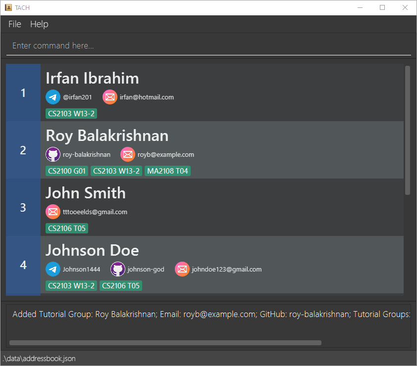

TACH is a desktop app that helps CS Teaching Assistants tutoring multiple modules & classes by keeping track of their students and monitoring their progress on their tutorials. It is optimized for CLI users so that frequent tasks can be done faster by typing in commands.

##Table of Contents
[coming soon]

--------------------------------------------------------------------------------------------------------------------

## Quick start

1. Ensure you have Java `11` or above installed in your Computer.

1. Download the latest `tach.jar` from [coming soon]

1. Copy the file to the folder you want to use as the _home folder_ for your TACH.

1. Double-click the file to start the app. The GUI similar to the below should appear in a few seconds. Note how the app contains some sample data. 
   

1. Type the command in the command box and press Enter to execute it. e.g. typing **`help`** and pressing Enter will open the help window. 
   Some example commands you can try:

   * **`list`** : Lists all contacts.

   * **`add`**`add -m CS2103T` : Adds a Module named `CS2103T` to TACH.

   * **`delete`**`delete -c CS2103T W15-3` : Deletes the Class `W15-3` from Module `CS2103T`.

1. Refer to the [Features](#features) below for details of each command.

--------------------------------------------------------------------------------------------------------------------

## Features

**:information_source: Notes about the command format:** 

* Words in `UPPER_CASE` are the parameters to be supplied by the user. 
  e.g. in `add -m MODULE`, `MODULE` is a parameter which can be used as `add -m CS2103T`.

* Items in square brackets are optional. 
  e.g `add -sd NAME e/EMAIL [t/TELEGRAM_HANDLE] [g/GITHUB]` can be used as `add -sd John Smith e/johnsmith@example.com t/JohnSmith g/johnsmyname` or without adding `t/JohnSmith`.

* Extraneous parameters for commands that do not take in parameters (such as `help`) will be ignored. 
  e.g. if the command specifies `help 123`, it will be interpreted as `help`.

### Viewing help : `help`

Shows a message explaining how to access the help page.

Format: `help`

### Adding: `add`

Add the specified item into TACH.

#### Adding Modules: `add -m`

Format: `add -m MODULE…`
* Adds the modules listed.

Example:
* `add -m CS2103T` adds the module `CS2103T` into TACH.

#### Adding Classes: `add -c`

Format: `add -c MODULE CLASS [v/VENUE] [z/ZOOM]`
* Adds the class into the given module.
* **NOTE**: If the module does not exist, it will create one automatically.

Example:
* `add -c CS2103T WS15-3` adds the class `WS15-3` into the module `CS2103T`.
* `add -c CS2103T G08 v/LT27` adds the class `G08` with the venue `LT27` into module `CS2103T`.
* `add -c CS2103T WS15-3 z/https://nus-sg.zoom.us/j/0123456789` adds the class `G08` with the zoom link  `https://nus-sg.zoom.us/j/0123456789` into module `CS2103T`.

#### Adding Students `add -s`

Format: `add -s MODULE CLASS STUDENT…`
* Adds the students into the given class in the given module.
* **NOTE**: If the module and/or class does not exist, it will create them automatically.

Example:
* `add -s CS2103T WS15-3 John Smith` adds the student `John Smith` into the class `WS15-3` in the module `CS2103T`.

#### Adding Student Details 

Format: `add -sd NAME  e/EMAIL [t/TELEGRAM_HANDLE] [g/GITHUB]`
* Adds details about a student. 
* **NOTE**: If the student does not exist, it will create one with the given details automatically.

Example:
* `add -sd John Smith e/johnsmith@example.com t/JohnSmith g/johnsmyname` will add the details of the email `johnsmith@example.com`, Telegram handle `JohnSmith` and Github `johnsmyname` into the student `John Smith`.

### Editing a person : `edit`

[coming soon]

### Locating persons by name: `find`

[coming soon]

### Deleting: `del`

Deletes the specified item from TACH.

#### Deleting Modules: `del -m`

Format: `del -m MODULE…`

* Deletes the modules listed.
* **NOTE:** This action is **recursive**! It will also delete all classes and students assigned to the deleted modules.

Example:
* `del -m CS2103T` deletes the module and all of its classes and students.
If class `W15-3` is under `CS2103T` and student `Jack Smith` is under class `W15-3`, 
both class `W15-3` and student `Jack Smith` will be deleted.

#### Deleting Classes: `del -c`

Format: `del -c MODULE CLASS…`

* Deletes the classes listed for the given module.
* **NOTE:** This action is **recursive**! It will also delete all students assigned to the deleted classes.

Example:
* `del -c CS2103T W15-3` deletes the class and all of its students.

#### Deleting Students: `del -s`

Format: `del -s MODULE CLASS s/STUDENT…`

* Deletes the students in the given class in the given module.

Example:
* `del -s CS2103T W15-3 s/Jack Smith` deletes `Jack Smith` from the class `W15-3` in module `CS2103T`.

### Getting: `get`

#### Getting a Module details: `get -m`

Format: `get -m MODULE`

* Gets all the classes and students in the given module

Example:
* `get -m CS2103T` to view all the classes and students added to the module CS2103T

#### Getting a Class details: `get -c`

Format: `get -c MODULE CLASS`

* Gets the specified class based on the given module

Example:
* `get -c CS2103T G08` view all the students in the class `G08` from the module `CS2103T`

#### Getting a Student's details: `get -s`

Format: `get -s MODULE CLASS s/STUDENT…`

* Gets the specified students' contact details and tutorial progress in the given module and class.

Example:
* `get -s CS2103T W15-3 s/Jack Smith s/Mary Jane` gets `Jack Smith`'s and `Mary Jane`'s contact details and 
tutorial progress in the module `CS2103T` of class `W15-3`

#### Getting the zoom link of a class
Format: `get -z MODULE CLASS`

* Gets the zoom link of the class
* **NOTE:** `zoom link not found` will be shown if the zoom link is not present

Example:
* `get -z CS2103T W15-3` gets the zoom link for this class

#### Getting the venue of a class
Format: `get -v MODULE CLASS`

* Gets the venue of the class
* **NOTE:** `venue not found` will be shown if the venue is not present

Example:
* `get -z CS2103T W15-3` gets the zoom link for this class

### Clearing all entries : `clear`

[coming soon]

### Exiting the program : `exit`

[coming soon]

### Saving the data

TACH data are saved in the hard disk automatically after any command that changes the data. There is no need to save manually.

### Editing the data file

TACH data are saved as a JSON file `[JAR file location]/data/tach.json`. Advanced users are welcome to update data directly by editing that data file.

:exclamation: **Caution:**
If your changes to the data file makes its format invalid, TACH will discard all data and start with an empty data file at the next run.

### Archiving data files 

[coming soon]

--------------------------------------------------------------------------------------------------------------------

## FAQ

**Q**: How do I transfer my data to another Computer? 
**A**: Install the app in the other computer and overwrite the empty data file it creates with the file that contains the data of your previous AddressBook home folder.

--------------------------------------------------------------------------------------------------------------------

## Command summary

Action | Format, Examples
--------|------------------
**Add Module** | `add -m MODULE`   `e.g. add -m CS2103T`
**Add Class** | `add -c MODULE CLASS [v/VENUE] [z/ZOOM]`   e.g. `add -c CS2103T G08 v/LT27 z/https://nus-sg.zoom.us/j/01`
**Add Student** | `add -s MODULE CLASS STUDENT…`   e.g. `add -s CS2103T WS15-3 John Smith`
**Add Student Details** | `add -sd NAME e/EMAIL [t/TELEGRAM_HANDLE] [g/GITHUB]`   e.g. `add -sd John Smith e/johnsmith@example.com t/JohnSmith`
**Delete Modules** | `del -m MODULE…`   e.g. `del -m CS2103T CS2101`
**Delete Class** | `del -c MODULE CLASS…`   e.g. `del -c CS2103T W15-3`
**Delete Student** | `del -s MODULE CLASS s/STUDENT…`   e.g. `del -s CS2103T W15-3 s/Jack Smith s/John Doe`
**Get Module Details** | `get -m MODULE`   e.g. `get -m CS2103T`
**Get Class Details** | `get -c MODULE CLASS`   e.g. `get -c CS2103T W15-3`
**Get Student Details** | `get -s MODULE CLASS s/STUDENT…`   e.g. `get -s CS2103T W15-3 s/Jack Smith s/Mary Jane`
**Get zoom link** | `get -z MODULE CLASS`   e.g. `get -z CS2103T W15-3`
**Get venue** | `get -v MODULE CLASS`   e.g. `get -v CS2103T W15-3`
**List** | [coming soon]
**Help** | `help`
